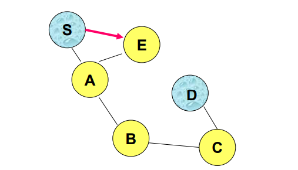
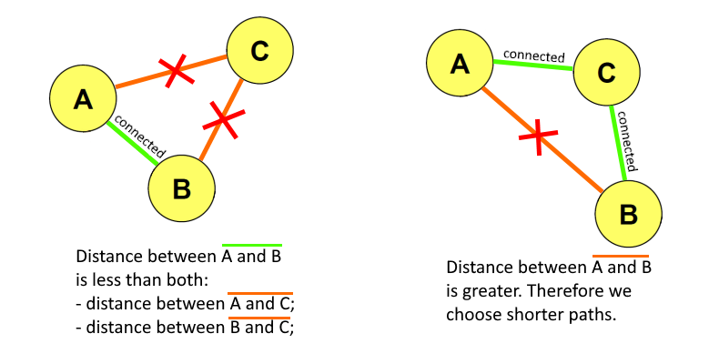
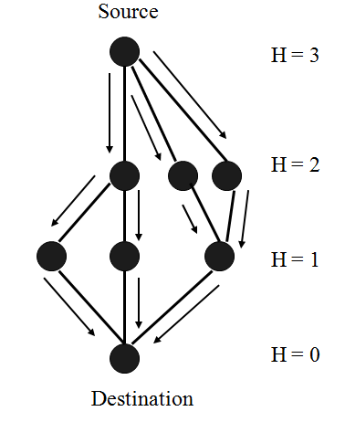
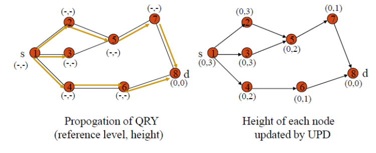
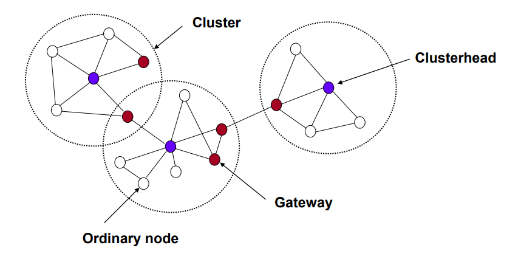

[[Index](./README.md)]&nbsp;&nbsp;
[[⏮️](./01%20-%20Wireless.md)]
[[◀️](./01%20-%20Wireless.md)]
[[▶️](./03%20-%20Mobile%20IP%20and%20Positioning.md)]
[[⏭️](./07%20-%205G%20and%20Mobile%20Edge%20Computing.md)]

<h1 align="center">Chapter 2 - MANET and Routing (ISO/OSI Layer 3)</h1>

### MANET
Not all mobile systems operate in infrastructure mode. A Mobile Ad hoc NETwork is a network that is created dynamically, on-the-fly, by nodes that operate in ad-hoc mode.
Main characteristics:
- dynamic creation, (to satisfy immediate necessities);
- quick deployment, highly configurable (no infrastructure needed);
- highly volatile resources (time-dependant resources, that may not be available in time continuity);
- heterogeneous nodes;
- battery nodes;
- each node is a potential router.

Problems:

#### Dynamic Source Routing (DSR)

Main differences between AODV and DSR:
- DSR stores path in headers -> lower space for data;
- AODV stores path in nodes -> much more space for data;

both have 2 discovery phases:
1. RREQ phase (in broadcast), to reach the destination node
2. RREP phase (in unicast), to go back to the source node, with a valid path to the destination.

### Ad hoc On-demand Distance Vector (AODV)
Ad hoc On-demand Distance Vector (AODV) is a reactive routing protocol. Let's break down its name:
- **ad hoc**, because its for MANET, where nodes communicate in ad hoc mode, without access points (not infrastructure mode);
- **on-demand**, because routes are only established and maintained when needed;
- **distance vector**, refers to the routing algorithm used. In networking, a "distance" vector routing algorithm, is a type of algorithm where each "router node" maintains a table that contains distance (cost) to every other router in the network. "Vector" refers to the direction/path to reach a destination. In fact, AODV uses route tables, where each entry has information about the destination node of the route entry (vector), and the number of hops needed to reach it (distance).

AODV steps:
1. S wants to send a packet to D;
2. S checks if it has a route to D;
3. If it doesnt, it starts a route discovery process (**flooding** in broadcast with RREQ);
4. Each node receiving RREQ, if it doesn't have a valid route to D, rebroadcast the message and updates its own ***route table***. A route table includes entries with the following information:
	- seq (sequence number), is used to track the freshness of routing information;
	- dest (destination node), identifies a destination node;
	- next (next-hop), contains the address of the next node of the route, to forward packets towards the destination node;
	- hop (hop count), the number of hops to reach the destination node;
5. When RREQ reaches D or a node with a valid route to D, a RREP is generated and sent back to S (in unicast);
6. When RREP travels back towards S, each node it passes by updates its route table, adding another entry. 

After the discovery phase, nodes will have cached route tables containing both direct and inverse paths. S will choose the table entry with the lowest number of hops, to reach the destination.

#### Timeout
To prevent nodes from maintaining invalid or obsolete entries in routing tables, each route expires after a given timeout. Timeout must be sufficiently long to allow RRES packets to return back from the destination.
Also, forward routes are removed after a certain amount of time (active_route_timeout) if not used. Since we are in MANET, the network is highly variable and mobile, so it's unlikely for a route to be valid during a long period of time. If that route is not used, it could just sit there wasting storage.

#### Link Failure Detection
Failure detection is performed both in reactive and proactive ways:
- **reactive**, when a forward towards an active node (towards which there was a route) fails. In this case all neighbours are informed, through a RERR packet and they invalidate their entry. When S receives RERR, it starts a new route discovery process towards D (NB: there's no certainty that there will be a node with a route to S, in this case typically it performs a flooding, hoping it will reach);
- **proactive**, by periodically sending hello messages to active nodes.

#### Optimizations
1) To limit flooding during route discovery phase, it's possible to perform flooding by using increasingly growing (over time) TTL, until a RREP is received.
2) If during the route discovery phase, a node receiving RREQ for a destination, already has a path towards it, it can instantly reply with RREP. But this can generate ***routing loops***, if RRER of the broken link is lost and the sender doesn't know it.

To solve Loops problem, it's possible to adopt a **Destination Sequence Number (DSN)**: RREQ carries a DSN, that is incremented at each hop. If a node has a route to the RREQ destination, with an higher DSN than the one from RREQ, then it replies with the route, otherwise it forwards the RREQ packet.

### Greedy Perimeter Stateless Routing (GPSR)
Greedy Perimeter Stateless Routing (GPSR) is a routing protocol that didn't have the same historic success than DSR and AODV (those two had a great success due to their simplicity), but is still an interesting approach.
It's a **geographical** routing protocol, that takes into account 2 important assumption, to reach the destination node:
- source node knows the location of the destination node;
- every node has a list of neighbor nodes and their locations (they achieve that by periodically exchanging location beacons).

There are 2 schemas for data forwarding:
- greedy forwarding
- perimeter forwarding;

#### Greedy Forwarding
In greedy forwarding, data is sent to the neighbor node that is estimated as the closes towards the destination, using only the location info of the neighbors of the current node.

In the example above, E is not in the coverage range of D, and no other E's neighbor is closer to E, therefore there is a forwarding failure.
When this happens, typically the algorithm switchs to perimeter forwarding.

#### Perimeter Forwarding
It tries to find a route around the "holes" (in the previous example, the hole was between E and D). Each node calculates a Relative Neighborhood ***Graph*** (RNG). This graph is defined by a simple constraint: two nodes A and B are connected only if there is not a third node C whose distance is less than A **and** B.

RNG then traverses the graph following the right-hand rule (counter clockwise), so in the previous example, it would reach S, then A, ...

Problem: there can still be loops, but they can be avoided by using sequence numbers in route tables, as in AODV.

[Comparative analysis paper](https://www.researchgate.net/publication/349377283_Comparative_analysis_of_AODV_DSDV_and_GPSR_routing_protocols_in_MANET_scenarios_of_real_urban_area#fullTextFileContent)

### Temporally Ordered Routing Algorithm (TORA)
Temporally Ordered Routing Algorithm (TORA) is a more recent, proactive, protocol, still used nowadays in practical settings. Main **characteristics**:
- highly adaptive, efficient and scalable;
- loop-free by design;
- highly distributed;

Key **design** concepts:
- control messages are exchanged by a very small set of nodes locally close to each other;
- nodes maintain routing info about their neighbors;
- a **height metric** is used to model the state of the network (the lower the height, the closer to the destination);

During route creation and maintenance nodes establish Directed Acyclic Graphs (DAGs). The data should follow the path that minimizes the height, like a liquid.

Basic functions:
- **Rroute creation**, based on a *query/reply* process, started by source S, towards destination D. It's performed by flooding a QRY packet. If a route exists, an UDP packet is returned.
- **Route maintenance**, link-reversal algorithm, that activates only when necessary (reacts when there is a link failure). NB: TORA reacts to link failures with **local** repairs.
- **Route erasure**, a CLR packet is flooded to erase invalid routes.

Route creation:

TORA has low overhead for control packets, since the reconfigurations are localized; TORA is also faster to respond to failures than DSR or AODV; 
However, each protocol/algorithm has its own usage/field, and usually it depends on the domain of the application and the aspects that it wants to optimize.

Consider that energy consumption typically is a big matter in mobile systems, and the power needed to transmit a packet is proportional to the packet size, but also proportional to distance².

NB: having a large per-hops distance (less nodes but very distanced), typically has more disadvantages than advantages.
- usually to increase the coverage area you have to repeat the signal in space;
- if you increase the frequency of the carrier => more bandwidth, but less distance;
- higher frequencies experience more absorption, more energy consumption and possibly even human health issues (since due to more transmission power);
- higher power => less antennas but less possibility of retransmission.
### Clustering
Clustering is a technique utilized to reduce resource consumption (especially power). It consists in dividing the network in groups of nodes (clusters) and sending to the cluster, a single dense packet that contains information for all the nodes included in the cluster: data aggregator.
It's particularly useful for sensors networks.

Nodes have different **types**:
- clusterhead, fundamental for forwarding of packets inside the cluster. It aggregates data from ordinary nodes which then sends to the gateway;
- gateway, allows to forward packets outside the cluster (to other clusters);
- ordinary nodes, typically are sensors.

#### Some Clustering Algorithms
- **Leach**, some local nodes are **randomly** chosen to be clusterhead, then each node chooses its most close one to aggregate. Clusterhead is periodically re-assigned;
- **Heed**, clusterheads are choosen by the **energy level** (cost function) of nodes, by a probabilistic election poll;
- Weighted Clustering Algorithm (WCA), similiar to Heed but takes into account different weights for the cost function.

### Wi-Fi Direct
In a Wi-Fi Direct network, nodes communicate by establishing a Peer-To-Peer (P2P) group, through a software Access Point. The device implementing the AP functionality, is called P2P Group Owner GO, and other devices acts like clients.
A device can also be both client and P2P GO, alternating the two roles by time-sharing the Wi-Fi interface.
Devices communicate by establishing a P2P group.

#### Comparison Bluetooth Scatternet vs Wi-Fi Direct P2P Group
|  | Bluetooth Scatternet | Wi-Fi Direct P2P Group |
| ---- | ---- | ---- |
| **Leader substitution** | If the master goes offline, a new one is elected | If the P2P GO goes offline, the P2P group needs to be recreated. |
| **Communication** | Only between master and slave | Full P2P (also between client and another client) |
#### Wi-Fi Direct Group Formation
In Wi-Fi Direct, the group formation procedure involves 2 phases:
1. **Determination of P2P GO**, which can be:
	- **negotiated**, two P2P devices negotiates for P2P GO based on their desires and capabilities;
	- **selected**, during the formation or for example at application level;
2. **Provisioning of P2P Group**, that involves the creation of a P2P group session with credentials that are provisioned through simple Wi-Fi configuration.

There are 3 group formation techniques, and the protocol includes all of them:
- **Standard**, involves a discovery phase to find existing groups and Wi-Fi networks (by probe/response). Then they negotiate: the nodes interested in becoming P2P GO declare it and include a random tie-breaker bit to prevent conflicts (the one with bigger bit will become the GO);
- **Autonomous**, a P2P devices autonomously creates a P2P group where it assumes the P2P GO role. Other devices can detect the group and connect.
- **Persistent**, similar to Standard, but after discovery phase, the P2P GO maintains the group info. Those can be used to re-establish the group (accelerating the process).
#### Power Saving Protocols
Wi-Fi Direct defines two power saving mechanisms:
- **Opportunistic Power Save  (OPS)** protocol, basically the P2P GO can go in power save mode, when it knows all the other nodes are sleeping;
- **Notice of Absence (NoA)** protocol, enables the P2P GO to announce "absence periods", which are time intervals where clients are not allowed ro access the channel. The schedule is defined based on 4 parameters (duration, interval, time, count);
#### Security
Wi-Fi Direct compliant devices must implement Wi-Fi Protected Setup (WPS) to support a secure connection with minimal user intervention (PIN or pushing a button).
### Dense MANET
A dense MANET is based on 2 assumptions:
- large number of devices co-located in a physical area relatively small;
- the node density is almost invariant over long time intervals.
There are some non-functional requirements: low overhead, high scalability, sufficient accuracy.

#### REDMAN
REplication in Dense MANet (REDMAN), is a protocol developed by unibo research group of Paolo Bellavista in 2005, to address the Olympics of Torino of 2006.

Basic idea: disseminate replicas of resources of common interest, within the Dense MANET, and maintain the desired replication degree, considering nodes mobility.
Entities involved:
- Delegates, host replicas and reply to retrieval requests;
- Managers, are responsible for maintaining the proper and desired replication degree.

Problems:
- how to identify a Dense MANET;
- Manager election;
- delegate disconnection;

