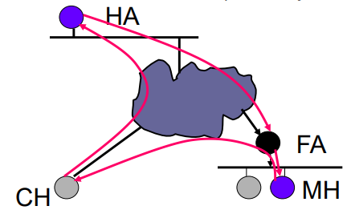
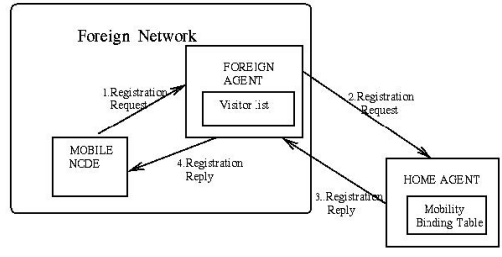
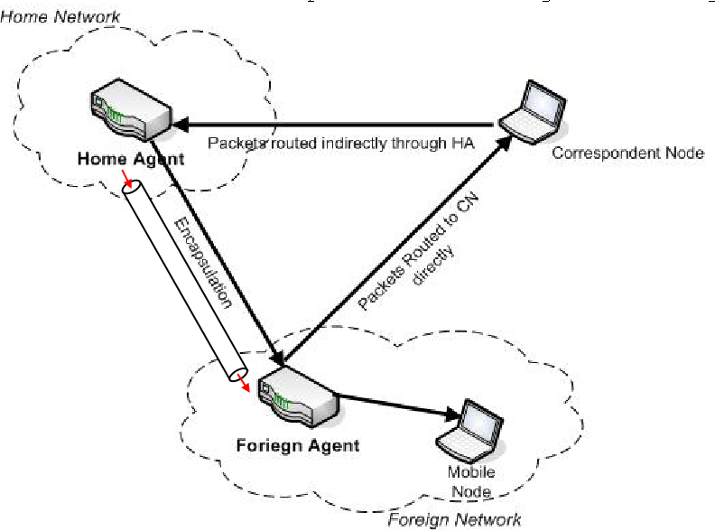
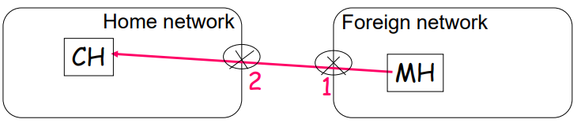
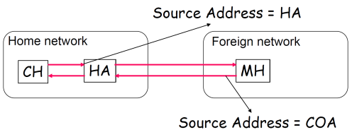
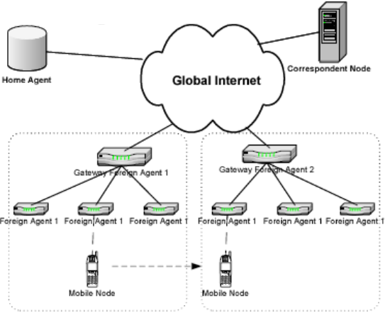
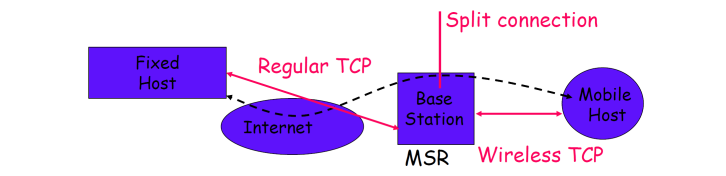

[[🔙](./README.md)]&nbsp;&nbsp;
[[⏮️](./01%20-%20Wireless.md)]
[[◀️](./02%20-%20MANET%20and%20Routing.md)]
[[▶️](./04%20-%20Internet%20of%20Things.md)]
[[⏭️](./07%20-%205G%20and%20Mobile%20Edge%20Computing.md)]

<h1 align="center">Chapter 3 - Mobile IP and Positioning</h1>

In infrastructured networks, the routing problem is already almost solved: the mobile node connects to an Access Point and the rest is managed through traditional routing.

However, when a node moves, it could change AP and the IP address (node identifier) as well, aborting any ongoing active connection. In GSM/3G/4G networks, there is a proactive resource acquisition for channel allocation to obtain service continuity. The solution would be to keep the same IP address for a mobile user even when it moves, but is it possible?

In basic Internet Protocol (IP), if the mobile node moves without changing its address, it loses routing; but if it does change its address, it loses connections.

### Position Management
2 approaches to know mobile nodes position:
- **location update**, nodes share their position to the infrastructure;
- **location search**, the infrastructure collects location information of mobile nodes;

In Wi-Fi typically the approach is location update, because it's not the purpose of Wi-Fi to discover position of mobile nodes; on the other hand, in cellular networks (GSM, etc.) the approach is usually location search.

#### Location Update
Mobile nodes update their position by notifying the infrastructure (nodes -> infrastructure).
Can be:
- **static**, updates are triggered when exiting a predefined area;
- **dynamic**, triggering depends on user communications and mobility patterns (e.g. data based on time, movement, distance, which are values that can change dynamically in time);

#### Location Search
The infrastructure collects location information of mobile nodes present under its coverage area (infrastructure -> nodes).
Different approaches:
- **blanket polling**, asking in local broadcast all the cells of an area (e.g. all the cells under the control of the MSC where the call arrives);
- **expanding ring search**, starting from the last known location of the device, incrementally expanding the search range (similar to *flooding* with increasing TTL);
- **sequential paging**, based estimation of location *probability* (sequentially from the most probable to the least one). 

### Host Identity Protocol
It was a network-level protocol that proposed to separate the identity and locality information of hosts:
- **Host Identity Tag (HIT)**, for the host identification;
- **IP address**, for the host location;
When Internet was born, it was designed for static network infrastructure "star-like", completely ignoring mobility and security.

To not change the TCP/IP stack (i.e. to not touch existing layers), it introduces a new intermediate layer (~2.5 layer) between network and transport layers.

**Main disadvantage**: compliant devices must implement HIP at kernel level, since they must change their TCP/IP stack.

### Mobile IP
Useful reference: [Oracle Docs on Mobile IP](https://docs.oracle.com/cd/E18752_01/html/816-4554/miptm-1.html)

Mobile IP is the only one level 3 standard that gained success in solving mobility issues in infrastructured networks. 

**Problem**: the IP address associated with a mobile node, depends on the network it's attached to. When it changes the network, the IP typically changes and packets belonging to currently active connections have to be delivered towards the new IP address.

**Intuitive solution**: ~**location update** approach. To handle it as if you were moving in a new apartment. You leave a new *forwarding address* to the old post-office, which then is delegated to send the messages to your new location.

#### Main Idea
Consider two nodes:
- **Mobile Node (MH)** (or Mobile Node MN), can move and receives data;
- **Correspondent Host (CH)**, can be fixed or mobile, and sends data (packets) to MH.
According to Mobile IP, the information about MH location, is always maintained in a third node called **Home Agent (HA)**. Therefore, when CH wants to send packets to MH, it doesn't send them directly to MH (CH doesn't know its position), but sends them to HA, which acts like an intermediary node. 
Actually, HA doesn't forward them directly to MH, but to another intermediary node called **Foreign Agent (FA)**.

Basically:
- **Home Agent (HA)** is the old post office (intermediary sender);
- **Forward Agent (FA)** is the new post office (intermediary receiver);

**Triangular routing problem**: when the HA is located far but MH and CH are close. In this situation the protocol is very inefficient.

##### Home Agent
It plays the role of **router** and is positioned inside the home network of MH. It's purpose is to **maintain the mobility binding** of MH's **IP address** with its **Care-of Address (CoA)**, which is an IP address that identifies the current location of MH (~basically the AP it's currently attached).

##### Foreign Agent
It's a router as well. When MH is not in the same network of HA, the FA is used to send/receive data to/from HA.
To associate MH to the FA in a certain area:
- **FA** periodically sends ***advertising* messages**, containing a set of available CoAs, to discover the MH in his own locality;
- **MH** can also not wait for advertising and send ***solicitation* messages** to receive a CoA from FA;

Once the MH is associated with the FA, it will receive from it a CoA (temporary IP), and the MH will register it at its HA, passing through the FA.

Example:
1. CH wants to communicate with MH (it knows its HoA - Home Address, MH's permanent IP). 
2. CH uses the permanent home IP address of MH as the destination address of the packets to send. 
3. But this IP address belongs to the HA, which instead of forwarding the packets to a node that is physically inside its network, it redirects them towards the CoA through an IP tunnel ([RFC 2003](https://datatracker.ietf.org/doc/html/rfc2003)). That's done by encapsulating the packet in a new IP packet, but with a different destination IP address in its header: the CoA.

#### Care-of Address
CoA is typically implemented through a normal IP address, used only by Mobile IP (hidden from upper layers).
There are two types of CoA (the network admin can decide which one to use):
- **Foreign Agent CoA**, it is the FA IP address itself and is provided to the MH through advertising messages. To distinguish between different MH under the same FA network, FA also registers the MH's **MAC** addresses. This way there's o waste of IP addresses.
- **Co-Located CoA**, is a temporary standard IP address, allocated by the FA for a single MH (e.g. through DHCP). This way, the HA packets can reach *directly* the MH (via tunneling) but, if there are too many, FA risks to run out of available local addresses.

#### Tunneling
The CH packet is encapsulated from HA in the payload of another packet that contains the CoA of the destination (MH) in its header. This mechanism is called **IP-withing-IP** ([RFC 2003](https://datatracker.ietf.org/doc/html/rfc2003) standard).

##### Practical Example
Suppose we buy a new laptop (MH) and we wanna use Mobile IP. We inform our network administrator, so it provides us a permanent Mobile IP (HoA): 10.0.8.5. This address binds us permanently to the HA, which is the gateway of the network to which our HoA belongs (10.0.8.0/24).
Then we move to a new FA (10.4.5.43) and we receive from it a new CoA (the address of the FA, 10.4.5.43). MH register it in the home HA, passing through FA.

A new node CH wants to communicate with us: it knows the IP of our laptop (10.0.8.5), and will send packets setting 10.0.8.5 as the destination address. Those packets will reach the HA, that will incapsulate them in a new IP packet with FA CoA destination (10.4.5.43).

When these packets reach FA, FA will decapsulate them and will route them towards our node, using the MAC address of our laptop.

To send packets back to CH, instead, we can use direct communication exploiting the node IP address, since it's contained in the packet's header source field.

> **NB**: if a MH leaves the FA network, and meanwhile it receives packets for the MH, those packets are dropped: there's no recovery mechanism in Mobile IP. However, upper layers could implement something to solve this issue (e.g. ACK in TCP).

#### Issues in Ingress/Egress Filtering
Suppose there's this unusual scenario: the CH is attached to the home network.

When CH sends a message to MH, it passes through HA, and it gets encapsulated to be sent to FA. The packet's header in this case would have "strange" values, that sometimes router's firewalls may filter automatically.

Routers may **drop MH packets** (due to security configurations) because the addresses don't match:
- **source address** not belonging to the HA internal network;
- **destination address** not belonging to an external network, but the HA's one;

These problems can be avoided by properly configuring the firewall to not discard those kind of packets. But isn't the idea of Mobile IP: Mobile IP doesn't want to impose any kind of extra configuration!
The only way to avoid these problems, directly in Mobile IP (without extra config), is to use the tunnel between HA and FA in both directions. 

Unfortunately, this solution generates another source of inefficiency, making the triangular routing even worse: quadrilateral routing. For this reason, typically this is left optional in Mobile IP, because not all routers have this kind of firewall.

#### Triangular Routing Optimization
Idea: make CH know the CoA of MH. After the first packet, the HA sends back to CH the CoA of MH, in a message called "CoA update". Afterwards, CH and MH can communicate directly, through tunneling.
Included in Mobile IPv6 standard: in IPv6 it was included the possibility, for a CH, to have direct visibility of the CoA of MH.
Those optimizations are critical in overhead reduction (to solve triangular routing), when CH and MH are under the same foreign network, but HA is far away (on the other side of the planet).

#### Hierarchical Mobile IPv6
Hierarchical Mobile IPv6 (HMIPv6) is a Mobile IP variant/extension to reduce signaling overhead and handover latency, by minimizing the tunneling reconstruction.

The space is divided in regions, each one managed by a sort of FA gateway, called **Mobile Anchor Point (MAP)**, that handles all the FAs under its management.
When a MH moves under the same MAP, there's no need to rebuild the tunnel between the FA and HA.

There are two main handoff models:
- local subnet handoff, if the handoff occurs between FAs under the same local MAP, the CoA will be registered in the MAP;
- MAP domain handoff, if the handoff occurs between FAs belonging to different MAPs, the regional CoA (RCoA) is registered at both HA and CH.

#### Wireless Mesh Network Management Mechanism
Wireless Mesh Network Management Mechanism (WMM) mixes HMIP and Mesh networks. The idea is to reduce global band consumption by locally handling handovers, without reaching HA. Basically this works by keeping distributed caches (replicated with weak consistency) of location information.
This improves scalability.
NB: you don't need the CoA to go everytime to the HA:
1. search in caches, if not found -> 2.
2. ask the mesh infrastructure, if not found -> 3.
3. flooding

#### Proxy MIPv6
One of the main issues of Mobile IPv6 is that nodes must implement it at kernel level.
To solve this, **Proxy Mobile IPv6 (PMIPv6)** introduces a proxy node, called Mobile Access Gateway (MAG) that implements MIPv6, making it almost completely transparent for mobile nodes.

##### PMIPv6 VS Mobile IP
The main comparison between PMIPv6 and Mobile IP is that:
- in IPMIPv6 the CH sends packets to the LMA (~similiar to the HA in MIP), that creates a tunnel towards MAG (~client in MIP) of the MN.
The difference is that, in PMIPv6, when a node moves from a MAG to another, the tunnel change occurs through a binding update, while in MIP, MHs are forced to be involved

TODO(?)

### I-TCP
Mobile infrastructured networks at layer 4. Is TCP suitable? Not at all.
Wireless links in mobile systems are characterized by frequent disconnections and reconnections (high Bit Error Rate - BER). Since TCP treats any problem as a congestion problem, those mobile systems problems causes a degenerative reduction in transmission speed (due to how TCP handles congestions, by incrementally increasing/decreasing the traffic speed).

I-TCP tries to solve this problem: it's a patch to TCP (transport level). The main idea is to **split the connection in segments**:
- we leave standard TCP where it doesn't cause problems, such as in cabled links (e.g. from Base Station MSR to Fixed Host);
- we adopt Wireless-TCP where there could be problems that traditional TCP would handle inefficiently, such as in wireless links.

The main disadvantages are that the end-to-end semantic is violated, and if a MSR breaks, there is a spike of latency and probable connection lost.

### Recap

TODO(?)

### Positioning Systems
Positioning systems can be classified in:
- **physical** systems, give specific numeric data that identify a location, such as latitude, longitude and ellipsoid height (altitude) (e.g. GPS); 
- **symbolic** systems, give symbolic positions, higher level of abstraction, such as "Italy", "University of Bologna", etc. Higher privacy because the position obtained doesn't allow to detect exactly where the device is located;
- **absolute** systems, the location refers to only one localization system;
- **relative** systems, the location depends on the position of another device.
- **centralized** systems, exploit a centralized system that collects info for each considered device;
- **distributed** systems, each device auto-detects its own location.

**Accuracy**: is the error range (radius of the "coverage range").
**Privacy**: is the confidence (probability) or trust degree, associated with the accuracy.

#### Basic Techniques

##### Lateration

#### GPS
Global Positioning System

#### D-GPS
Differential GPS (D-GPS)

#### Indoor Environments

##### Active Badge

##### Active BAT

#### Without Dedicated Hardware

##### GSM-based

##### Bluetooth-based

#### Wi-Fi Fingerprinting

##### PlaceLab

##### RADAR

##### Ekahau

#### Sensor Fusion and VTT

##### JSR-179 

##### PoSIM
