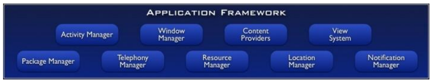

<span id="back-to-top"/>

[[🔙](./README.md)]&nbsp;&nbsp;
[[⏮️](./01%20-%20Wireless.md)]
[[◀️](./04%20-%20Internet%20of%20Things.md)]
[[▶️](./06%20-%20Discovery.md)]
[[⏭️](./07%20-%205G%20and%20Mobile%20Edge%20Computing.md)]

<h1 align="center">Chapter 5 - Android</h1>

### Mobile Middleware

Typically hourglass model in mobile application: heterogeneous lower layers, convergence at transport layer (TCP/IP), and again different upper layers related to different needs and requirements of applications.

Cross-layering: different types of interaction for different ways of cross-layering in a protocol stack

- upward information flow
	example: could be useful to propagate location information from hardware (e.g. GPS) to upper layer, cause maybe an application needs them.
- downward information flow
	typically used to configure parameters and settings of lower levels.

#### Architectural Patterns

#### Mobile Computing Patterns
3 main categories:
- for distribution
- for resource management and synchronization
- for communication

### Android

Linux Kernel (95% the same, with some more features, for example for shared memory, communication between processes by using shared memory, power management, etc.)

extra useless Linux features have been removed (compilers, commands and programs)

Only expected to use Java (or Kotlin, still on JVM).

The core system of Android is a special JVM (now called Andoird RunTime - ART, once it was the Dalvik Virtual Machine). It's not the standard Java, it has a lot of differencies, in some classes have been removed, some have been added.
E.g. no support to create processes, cause in Android you are not supposed to do it, for security reasons.
Android bytecode won't work on a standard JVM, and a standard bytecode compiled from a standard Java program won't work on ART.

ART is **registry based**, compared to stack based traditional JVM, since it was decided that the most common processor architecture for Android phone was ARM. Stack-based, on the contrary, is more portable, because it can work on different architecture.

ART is also highly optimized for mobile devices, and the **bytecode** compiled for it is also very optimized (much important in mobile devices).
**Garbage collector** was also changed to not have visible spikes of low performances, because compared to a Desktop app, in a smartphone that's not acceptable



The higher layer is the one that developers can use, and it includes a Package Manager to install and manage APKs, and other interesting components.

#### Lifecycle of Activities

##### States
- Running
- Paused
- Stopped
- Inactive
- Killed


#### Task
a Task is an entity that models a "conversation" with the user. It's associated with each application in execution and contains a stack LIFO of Activities. Only the one on top of it is the running one, (state running). The Activities in the task can also be from other applications!

When an activity starts it's pushed on top of the stack.

important concept of Task: for each app in execution, the different activities that has been started for this app are organized in task (android modeling of the concept of conversation)
e.g. I have a complex high level operation to be completed for the user, I split it in different steps 

each activity is one step of the high level operation, and you pass them to

a task in android is represented as a stack

only the activity on top of the stack is the one currently running.

each app has a task describing the set of operations.


the task support is not so separated app per app: it's very frequent/common in android that when a user interacts with the activity of an app, it triggers the activity from another app.

#### Intent and IntentFilter
Intent is used to specify a "control passing".

Implicit intent vs explicit intent:
- explicit (known at compile time) is less used and already specify the destination of the intent;
- implicit (not known at compile time) doesn't specify the destination, and it's the Android middleware that handles it (it searches if there is a default app set to handle that type of Intent, e.g. add new contact, and if there's not, it asks the user which app it would like to use);
3 cases:
- Android finds only one Activity match for the intent => pass the control to the Activity;
- Android doesn't find any Activity match => the intent is not delivered (lost intent);
- Android finds more than one Activity (no default option specified) => it prompts the user to choose which one to use.
NB: that's because Intents are one-to-one triggers, not multicast! So there can be only one receiver that handles it and takes control.


### Threading Model

Each application has a single thread by default.
Possibility to save the state into Bundle.
Main loop for each thread, with message queue management.


Basically 2 models:
- 1 DVM for each application
- DVM shared (different apps with same UserID) - with this must pay attention to security issues.

NB: each DVM runs in its own process!

#### Scheduling

The runtime handles it and there are 4 process level:
1. foreground
2. visibile
3. service
4. background

Foreground app typically has about 90% of the CPU assigned.

### Asynchronous Techniques

Thread
Executor
HandlerThread
AsyncTask
Service
IntentService
AsyncQueryHandler
Loader

#### Service

Runs in background and doesn't provide any UI nor can it modify the UI directly.
They're typically started by the receiving of an Intent and they run on the main thread.

Examples: music playing in background, file download, etc.

3 types of service:
- started
- bounded
- foreground

##### Started Service

Started with `startService(myIntent);`

`onStartCommand(){}`

##### Bound Service

Special type of Service that offers a client-service interface: it'll run in background and act as a server, while other clients (activities) on the same device can bind and use the features it provides.

Started with `bindService(myIntent);` (e.g. called by an Activity).

`onBind(Intent intent){}` returns an IBinder object that allows clients to communicate with the service.

Bound services are destroyed when there's no clients bound to them.

Question: if the service cannot directly access the UI, how do you update its component to show the results?
You use a broadcast receiver!

##### Foreground Service
Foreground services runs in background but require the user to be aware that they exist and are running. They have higher priority and are unlikely to be killed by the system. They must provide a notification which the user cannot dismiss while it's running.


NB: a service can use worker threads to perform the workload. That's important because if the thread blocks, the UI freezes too.


#### IntentService
They use worker threads to perform an operation, cannot be interrupted, and are automatically destroyed once the operation terminates.
They're particularly useful for things like downloading a file

#### Thread
Very similar to traditional Java threads, cannot directly work on UI (not thread safe).
Launched with `start()`
#### Handler
Used to create a communication channel between main thread of an app and a new thread.
[...]

#### AsyncTask
Services cannot interact directly with UI, therefore, we can use AsyncTask: they're created on UI thread and can be executed only once, in a background thread. After their execution, they can update the UI to show results. 
They are especially useful to perform something inside an Activity, directly related to the Activity itself.

- `onPreExecute()` invoked immediately after the AsyncTask to prepare it (e.g. it can show a loading bar);
- `doInBackground()` to perform the operations (executed in a separated thread);
- `onProgressUpdate(Progress...)` updates the progreess of the AsyncTask (e.g. can update the loading bar);
- `onPostExecute()` typically to update the UI by showing the results and release AsyncTask resources;

This class was deprecated with Android 30 and now it's expected that we use Kotlin concurrency.

Example: download a file.
```
// AsyncTask parameters are:
// 1. Type of parameters (e.g. URL/list of URLs)
// 2. Type of progress unit (e.g. Integer -> 5, 10, ...)
// 3. Type of result (e.g. Image)
public class MyDownloader extends AsyncTask<Params, ProgressUnit, Result> {
	
	// executed on main thread (UI)
	@Override
	protected void onPreExecute () {
		// show a loading bar (main thread -> edit UI)
	}


	@Override
	protected Image doInBackground() {
		// Download image from Repository
	}


	@Override
	protected void onProgressUpdate(Progress...) {
		// Progressively update loading bar (main thread -> edit UI)
	}


	@Override
	protected void onPostExecute(Item response) {
		// Remove loading bar and show result (main thread -> edit UI)
	}
}

// Then to use it
class MyActivity extends Activity {

	@Override
	protected void onCreate(Bundle savedInstanceState) {
		super.onCreate(savedInstanceState);
		mPrefs = getSharedPreferences(getLocalClassName(), MODE_PRIVATE);
		
		// Run the AsyncTask
		MyDownloader myDownloader = new MyDownloader();
		myDownloader.execute();
	}
}
```

#### Broadcast
