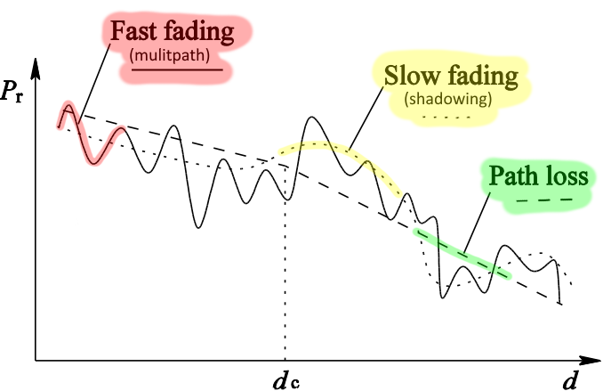
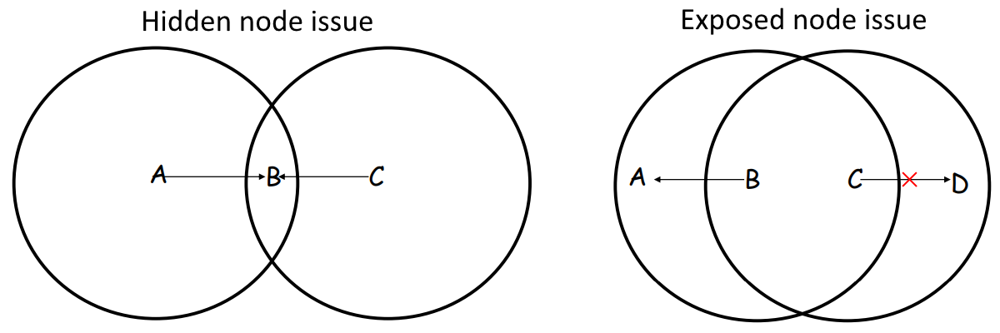
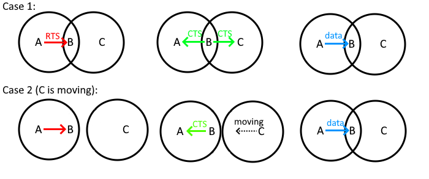
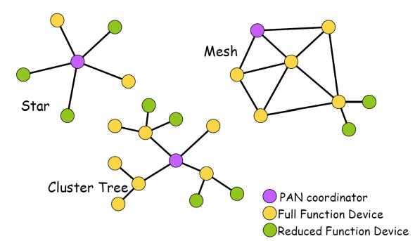
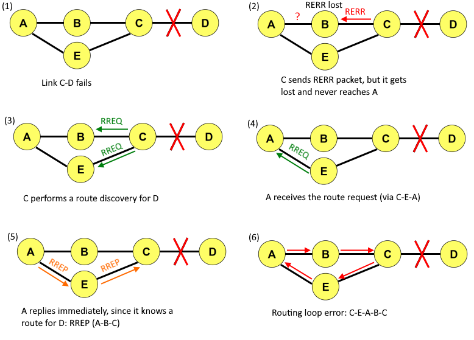
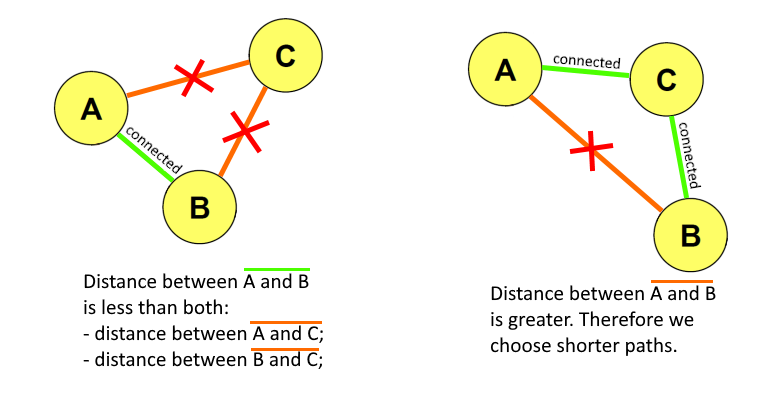
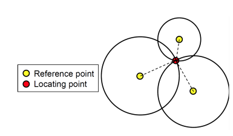
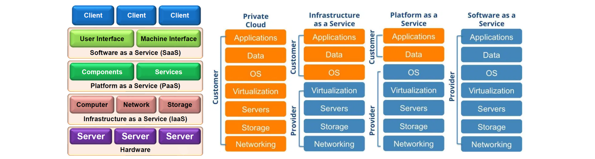
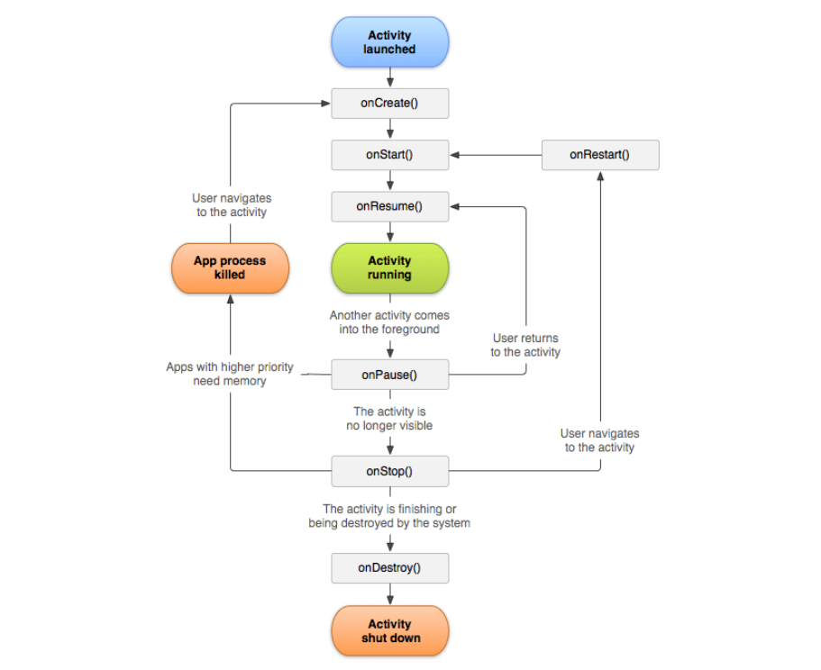
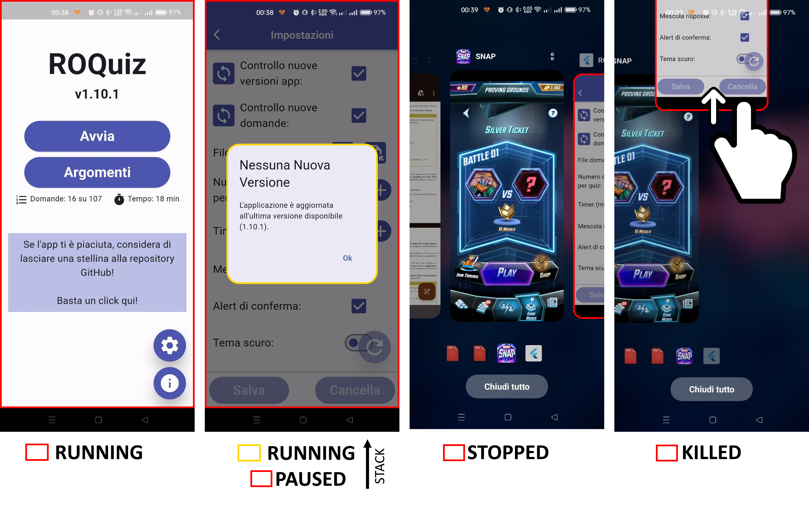

<span id="back-to-top"/>
<h1 align="center">Flashcards</h1>

## Table of Contents

<details open>
  <br/>
  
  1. [Wireless Communication](#chapter-1---wireless-communication)
  2. [MANET](#chapter-2---mobile-ad-hoc-network-manet)
  3. [Mobile IP and Positioning](#chapter-3---mobile-ip-and-positioning)
  4. [Internet of Things](#chapter-4---internet-of-things-iot)
  5. [Android](#chapter-5---android)
  6. [Discovery, Messaging and Events](#chapter-6---discovery-messaging-and-events)
  
</details>

## Chapter 1 - Wireless Communication

### Wireless Signals Propagation
**Question**:
- How is the **wireless signal propagation** influenced?
- What are **channel fading models**?
- Provide some example.

<details><summary><b>Answer: </b></summary>

#### How is the **wireless signal propagation** influenced?
Wireless signals are less reliable than cabled ones, since wireless signals are never 100% guaranteed to be received. When traveling through air, the wireless signal experiences propagation losses, due to the planet/atmosphere and physical phenomena. These losses influences the strength of the signal that, to be received, needs to reach a given threshold.
To understand how wireless signals propagate, researches created 2 propagation models, based on Maxwell's laws:
- **Free-space loss**, according to which, the power of a wireless signal propagating in empty space decrease with its traveled distance (inverse of the square of the distance).
- **Plane earth loss**, according to which, due to Earth's curvature, the power of a wireless signal decreases when traveling along Earth's surface (inverse of the fourth power of the distance).

#### What are **channel fading models**?
In real-world scenarios, the conditions are much more complex, and these are, in fact, just approximated models. In real world there are many phenomena that contribute to the
degradation of the wireless signal. The most important and common are:
- **shadowing**, is due to obstacles along signal path. Causes long-term/slow variation in signal strenght;
- **multipath fading**, is due to signal reaching the receiver through different paths. Causes rapid oscillations in signal strenght;
- **frequency selective fading**, is due to how different ranges in frequencies sprectrum react to noises and other effects. Causes frequency-dependent variations in signal strenght.



Also other phenomena, like rain, magnetic fields, irregular surfaces.

</details>
<p align="right">(<a href="#back-to-top">back to top</a>)</p>

---

### Ethernet
**Question**:
- How does **Ethernet** try to **avoid collision** on a shared communication medium?

<details><summary><b>Answer: </b></summary>

#### How does **Ethernet** try to **avoid collision** on a shared communication medium?
Ethernet (IEEE 802.3) is an optimistic approach, meaning that try to avoid collisions as bet as it can. There were old Ethernet competitors, such as token-passing ring, that instead avoided collisions by design, but they didn't have so much success as Ethernet.
Ethernet adopts the algorithm called CSMA/CD (which stands for Carrier Sensing Multiple Access with Collision Detection)
- **Carrier Sensing** (CS), means that the devices that participate in the communication, senses the medium (e.g. cable) to check if it's being used or it's idle. If idle, the device trasmits immediately, otherwise it waits;
- **Multiple Access** (MA), means that the communication medium is shared between potentially multiple different devices, that could possibly want to use it at the same time;
- **Collision Detection** (CD). When a device transmits, it keeps listening to the medium and, in case it detects a collision, it immediately stops the trasmission and waits. To try again and retransmit, one must wait for a **random time interval**, choosen according to the **exponential backoff**: after each collision, the waiting time increases exponentially, preventing consecutive collisions to happen.

</details>
<p align="right">(<a href="#back-to-top">back to top</a>)</p>

---

### CSMA/CD
**Question**:
- What is **CSMA/CD**?
- Can **CSMA/CD** work correctly over **wireless** medium?
- What are the **most common issues**?

<details><summary><b>Answer: </b></summary>

#### What is **CSMA/CD**?
CSMA/CD is a collision detection algorithm used in Ethernet networks to manage access to a shared communication medium, typically a full-duplex cable in modern environments.

#### Can **CSMA/CD** work correctly over **wireless** medium?
It cannot work correctly in wireless communication, because the communication here is more like a probability: we're never 100% sure a message will be received or not, and there's no easy way to monitor a wireless signal.

#### What are the **most common issues**?
Moreover, there are 2 most common issues

- **Hidden node issue**. It occurs when a node (A) starts transmitting to another one (B), and a third node (C) cannot detect the already ongoing transmission between the other two. Therefore, when it starts transmitting as well, it causes a collision;
- **Exposed node issue**. It occurs when a node (B) transmits to another node (A), and a third node (C) doesn't start transmitting to its peer (D) because it detects the already ongoin transmission between the other nodes, even tough it doesn't interefere with it.

</details>
<p align="right">(<a href="#back-to-top">back to top</a>)</p>

---

### WiFi
**Question**:
- What is **WiFi** and what are its characteristics?
- What are the primary WiFi **configurations**?

<details><summary><b>Answer: </b></summary>

#### What is **WiFi** and what are its characteristics?
WiFi (IEEE 802.11) is a standard for short range (up to 250m) wireless transmission, up to 866Mbps bandwidth. The standard covers the first two layers (physical and data link/MAC) and provides some security aspects. It doesn't include Quality of Service (QoS) specifications.

#### What are the primary WiFi **configurations**?
There are two primary WiFi configurations:
- **Ad hoc mode**, in which nodes communicate directly, peer-to-peer. Each endpoint potentially a mobile node and is connected to the other. Distant node could communicate by using a chain of ad hoc connections. It's more complex, and less used than infrastructure mode.
- **Infrastructure mode** (base station), in which there are some fixed, cabled nodes called Access Points (APs/base stations). A mobile node can obtain a list of the available APs by using the _probe/response_ protocol. Afterwards, it can connect to one (or more, if the mobile node has different WiFi cards) manually or automatically.

</details>
<p align="right">(<a href="#back-to-top">back to top</a>)</p>

---

### MACA
**Question**:
- Does **MACA** solve hidden node and exposed node issues?

<details><summary><b>Answer: </b></summary>

#### Does **MACA** solve hidden node and exposed node issues?

- **Hidden node issue**: MACA can partially solve this issue, but there are still few cases when it may occur. For example, C may not hear CTS because it was out of range, but it's moving towards B.
- **Exposed node issue**: is untouched.

However, MACA introduces also some **overhead**, and that's the reason why in modern implementations it's left **optional**.

</details>
<p align="right">(<a href="#back-to-top">back to top</a>)</p>

---

### Global System for Mobile communications (GSM)
**Question**:
- What is **GSM**?
- How is it **structured**?
- What are Home Location Register (**HLR**) and Visitor Location Register (**VLR**)?

<details><summary><b>Answer: </b></summary>

#### What is **GSM**?
Global System for Mobile communications (GSM) is the most widely used standard for mobile phones globally, and serves as the foundations for 2G mobile networks, and its principles are still used nowadays, in modern technologies. GSM has a hierarchical architecture that follows the locality principle.

#### How is it **structured**?
GSM architecture includes different elements:
- a Mobile System (**MS**), that is composed by:
  - Terminal Equipment (**TE**), associated with SIM card, containing terminal/user specific data;
  - Mobile Terminal (**MT**), that allows to communicate with the BSS;
- a Base Station Subsystem (**BSS**), that is composed by:
  - Base Station Controller (**BSC**), that allocates radio channels and handles handovers. BSC manages many BTS;
  - Base Transceiver Station (**BTS**), that handles connections with MS;
- a Mobile Switching Center (**MSC**), that acts like a gateway to the Wide Area Network (WAN), that includes Public Switching Telephone Network (PSTN) and packet data networks (such as Internet);
- an Operation Support System (**OSS**), that handles monitoring, control and management of the network;

2 registers in OSS:
- AUthentication Center (AUC), used by HLR to authenticate users before service access;
- Equipment Identity Register (EIR), is used to identify stolen devices through IMEI.

#### What are Home Location Register (**HLR**) and Visitor Location Register (**VLR**)?
MSC contains 2 registries, needed to perform calls processing, location tracking and mobility management in GSM networks:
- Home Location Register (**HLR**), is a centralized database that stores **permanent** information about subscribed mobile devices. When a user buys a subscription (via SIM card), all the user and subscription info gets registered in HLR (credit, cost, profiles, activated services, etc.). It won't be updated again;
- Visitor Location Register (**VLR**), is a **temporary** database that stores information about mobile devices that are currently within the MSC coverage area (under the BSSs it manages).

When a MS moves to a new MSC (MSC1 -> MSC2), the VLR of MSC2 will add an entry for the MS, by querying the HLR of MSC1. Having information locally is a way to create some sort of load balancing, since once the info are saved in the local VLR, there's no need to keep querying the HLR.

</details>
<p align="right">(<a href="#back-to-top">back to top</a>)</p>

---

### GSM: Handoff (1)
**Question**:
- What is the **handoff** in GSM?
- How is it **classified**?

<details><summary><b>Answer:</b></summary>

#### What is the **handoff** in GSM?
The handoff (or handover) is a procedure in GSM that allows a mobile device to seamlessly **switch connection** from one cell to another, without interrupting an ongoing call or a data session. It's purpose is to provide service continuity.
It has many advantages, such as:
- always be connected to the BSS with the **strongest signal**;
- **load balancing** between different BSS;

The GSM standard doesn't specify when or why the handover should occur, but just the mechanism.

#### How is it **classified**?
Handoff classifications:
- connectivity:
  - **horizontal**, if same connectivity (GSM);
  - **vertical**, if different connectivity (WiFi -> 4G);
- node that initiate the procedure:
  - **network-initiated** (GSM);
  - **mobile-initiated** (WiFi);
- when it's triggered:
  - **proactive**, if the handoff is triggered before the connection to previous AP is lost (GSM);
  - **reactive**, if the handoff is triggered only after the connection to previous AP is lost (WiFi);
- management
  - **hard**, when the old connection breaks before the new one is established (GSM, WiFi);
  - **soft**, when the old connection is kept until the new one is established (WiFi with 2 cards);

</details>
<p align="right">(<a href="#back-to-top">back to top</a>)</p>

---

### GSM: Handoff (2)
**Question**:
- How is the **handoff** handled (distinguish between same and different localities)?
- Can packets be **lost**?
- Does a long call create a chain?
- Is the MSC chain kept?

<details><summary><b>Answer: </b></summary>

#### How is the **handoff** handled (distinguish between same and different localities)?
Steps for the **handoff under the same MSC**:
1. Old BSS decides to perform the handoff process and sends a message to the MSC, provide a list of possible new BSSs.
2. MCS notifies the new BSSs, because they need to allocate resources.
3. (If there is enough space) the new BSS allocates the radio channel for the new visitor. If it doesn't arrive in time, it gets deallocated.
4. New BSS notifies the MSC and old BSS that it's ready.
5. Old BSS informs the mobile device the need to operate handover towards the new BSS.
6. The mobile device signals to the new BSS to activate the new channel.
7. The mobile device signals to MSC that the handoff has been completed, and MSC performs re-routing.
8. The MSC deallocates resources of the old routing path and notifies the old BSS that deallocates the old radio channel not used anymore.

Steps for the **handoff under different MSCs**:
Suppose that a correspondent node wants to call a mobile node D:
1. MSC_S (to which S is attached) queries HLR_D, through D's phone number, to obtain information about the called node D (including the current VLR of D);
2. from D's HLR (HLR_D) it's possible to reach to the current VLR (VLR_D) of MSC (MSC_D1) to which D is attached;
3. MSC_S reaches to MSC_D1 to coordinate the call setup;
4. a path is enstablished between MSC_S and MSC_D1 and the call starts.

MSC_D1 will be the **anchor MSC** and everytime the destination moves, changing MSC, the new MSC will be happended to the end of the chain. E.g. if MSC_D2 is the new MSC: MSC_S -> [...] -> MSC_D1 -> MSC_D2.\
The anchor MSC serves to maintain information about the call or data session (such as the cost, duration, etc.)

#### Can packets be **lost**?
Yes they can, especially with hard handoffs. Actually, it's almost impossible to have avoid packet loss completely, but there are mitigation techniques

#### Does a long call create a chain?
If a node is moving, typically a long call creates a chain of MSC, where newer MSCs gets appended to the latest visited one. The first one is called anchor MSC, is always present and doesn't change for the whole duration of the voice call or data session.

#### Is the MSC chain kept?
The MSC chain can be kept or not, it depends. There is a standard called IS-41, that optimizes the MSCs chain path, linking the anchor MSC directly with the latest MSC visited.

</details>
<p align="right">(<a href="#back-to-top">back to top</a>)</p>

---

### Bluetooth
**Question**:
- What is Bluetooth and what are its main **characteristics**?
- What are the differences with **WiFi**?
- How is a piconet built? What are Bluetooth **phases**?
- What is **frequency hopping**?
- What are the differences between **ACL** and **SCO**?
- Is there **retransmission** in SCO? Why?

<details><summary><b>Answer: </b></summary>

#### What is Bluetooth and what are its main characteristics?
Bluetooth (IEEE 802.15.1) belongs to the family of Personal Area Network (PAN) protocols, which range is quite limited (10-100m). It was created to **replace cables** with a low cost solution that had a decent datarate (at least 1Mbps). The network topology it uses is called piconet, and is formed by a _master_ and up to 7 _slaves_.
Bluetooth standard defines not only the protocol but also the associated software stack, as well as profiles for its usage.

#### What are the differences with **WiFi**?
The main differences with Wi-Fi are:
- uses cases;
- coverage range;
- data transfer rate;
- power consumption;
- in Bluetooth the communication always passes through the master, in Wi-Fi the communication is P2P between AP and MNs;
- Bluetooth needs a preliminar discovery phase;
- Bluetooth has a very limited broadcast mechanism;

#### How is a piconet built? What are Bluetooth phases?
Bluetooth piconets are built through 2 phases:
1. **Inquiry** phase: a node that wants to communicate enters the inquiry mode, sends its ID to neighbours and collects answers (IDs) from them. After some time, if it has collected at least one ID, it enters the page phase. The node that initiated the inquiry phase typically becomes the master; 
2. **Page** phase: the master sends its clock value to slaves to synchronize with them. There is some information exchange, including the sequence for the frequency hopping. Then the data exchange can begin.

#### What is **frequency hopping**?
Bluetooth uses the 2.4GHz ISM band (from 2.4 to 2.4835 GHz), which is also the same range of frequencies used by many wireless technologies/devices (including WiFi), since this band was designated for unlicensed operations. What's the consequence of this? It's that different technologies based on 2.4GHz, may interfere the one with the other.

Bluetooth, to manage its communication over this overcrowded band, uses a mechanism called "**frequency hopping**": the 2.4GHz band can be divided into 79 channels, each of 1MHz width. The bluetooth actively changes communication channel, by hopping between frequencies in a defined sequence (based on master's address): the communication _timeline_ is divided in time slots (625 picoseconds, 1600 times per second), in which only a device can communicate. This prevents interferences and adds a layer of security.

There is also an optimized version, called "adaptive frequency hopping", to better improve this mechanism, marks channels with high interferences as "bad channels" and avoid them.

#### What are the differences between **ACL** and **SCO**?
Bluetooth supports two types of connections:
- **Asynchronous Connection-Less (ACL)**:
  - is used only for data (no voice);
  - higher datarate (>500Kbps);
  - packet-switched connections;
  - point-multipoint connections;
  - symmetric/asymmetric connections;
  - retransmission of lost packets;
- **Synchronous Connection-Oriented (SCO)**:
  - is used for multimedia data in real-time;
  - lower datarate (64Kbps);
  - circuit-switched connections;
  - point-point connections;
  - symmetric connections;
  - no retransmission of lost packets;

#### Is there **retransmission** in SCO? Why?
In Bluetooth SCO there is NO retransmission if packets are lost, because in real-time communication the user just wants low latency, it doesn't care about the multimedia content to be completely intact (e.g. think about voice calls).

</details>
<p align="right">(<a href="#back-to-top">back to top</a>)</p>

---

### ZigBee
**Question**:
- What is ZigBee and what are its **characteristics**?
- What are the possible **topologies**?
- What are the **roles**?

<details><summary><b>Answer:</b></summary>

#### What is ZigBee and what are its **characteristics**?
ZigBee (IEEE 802.15.4) is a PAN standard, specifically designed for industrial environments: networks of sensors and actuators. It optimizes network formation time (less than 30ms) and supports full mesh networking.

It's main characteristics are:
- reliability;
- cost-effectiveness;
- low power;

#### What are the possible **topologies**?
There are 3 different topologies:
- **star**;
- **mesh**;
- **cluster tree**;



#### What are the **roles**?
The roles of nodes are:
- **PAN coordinator** (similiar to master in BT), there is one for each ZigBee network. It activates the network formation and acts like a router once the network is functioning. It must be a reliable node (battery, limited mobility, etc.).
- **Full Function Device**, participates in message routing;
- **Reduced Function Device**, executes only sensor/actuator operations.

</details>
<p align="right">(<a href="#back-to-top">back to top</a>)</p>

---

## Chapter 2 - Mobile Ad Hoc NETwork (MANET)

### MANET
**Question**:
- What are MANETs and what are their main **characteristics**?
- What are their main **problems**?
- What are the **types** of routing protocols?

<details><summary><b>Answer: </b></summary>

#### What are MANETs and what are their main **characteristics**?
Mobile Ad hoc NETworks are networks made by nodes that communicate in ad hoc mode, therefore there's **no infrastructure** of any kind that supports the communication between devices, compared to the more common base station mode. Its main characteristics are that they're very dynamic, they can be created and configured quickly, on-the-fly; the involved nodes are typically heterogeneous; each node is a potential router.

#### What are their main **problems**?
MANETs problems are: limited range, hidden node issue, transmission error, mobility, energetic limits and security. Also, even though it should be obvious in ad-hoc mode, in MANETs the routing is quite complicated.

#### What are the **types** of routing protocols?
Routing protocols in MANETs can be divided into:
- **proactive** protocols, keep valid routes regardless of ongoing traffic;
- **reactive** protocols, keep valid routed only when there's traffic (on communication demand);
- **geographic** protocols, use the destination location to route the messages;
- **hybrid** protocols, that combine other categories.

</details>
<p align="right">(<a href="#back-to-top">back to top</a>)</p>

---

### Flooding Routing
**Question**:
- How does flooding routing protocol **works**?
- **When** is it used?
- How can it be **optimized**?
- What is the **broadcast storm issue**?

<details><summary><b>Answer: </b></summary>

#### How does flooding routing protocol **works**?
Flooding is the most basic and simple routing protocol, where each node forwards an ingoing packet to each node available in broadcast, except for the sender (the one from which the current node received the packet), until the destination is reached.

#### **When** is it used?
Flooding is the simplest, most trivial and straightforward routing protocol. It has some advantages, such as the fact that it doesn't require any storage of information on nodes. It has many problems, mostly efficiency ones, since the number of generated packets grows exponentially with the number of nodes. However, it still finds some uses, for example in emergency scenarios or when there's no way around. Flooding is often used in conjunction with other protocols, for example to deliver control packets.

#### How can it be **optimized**?
Examples:
- to **avoid recursive sends** (sending a packet to a node that already received it), we could add an ID to the packet;
- to **avoid infinite hops** even after the packet is received, we could use a TTL (Time-To-Live);

#### What is the **broadcast storm issue**?
Broadcast storm issue, is something that's often involved in flooding, and occur when a large number of broacast or multicast messages are rapidly propagated and circulated through the network (nothing -> nothing -> spike of traffic -> nothing -> ...). That creates excessive traffic and potentially degrading network performances.

</details>
<p align="right">(<a href="#back-to-top">back to top</a>)</p>

---

### DSR Routing ([RFC 4728](https://www.rfc-editor.org/rfc/rfc4728.html))
**Question**:
- What is DSR routing and how does it **work**?
- What **problems** there could be?
- How can it be **optimized**?

<details><summary><b>Answer:</b></summary>

#### What is DSR routing and how does it **work**?
Dynamic Source Routing (DSR) is a full reactive routing protocol, where the sender has to find a valid routing path. The steps for Source (S) to find a valid route to reach Destination (D), are the following:
1. S uses **flooding** to send a **control packet RREQ** (Route REQuest) in broadcast;
2. Each node that receives RREQ check if it doesn't have already sent it, and if it did not, it appends its node ID and forwards the packet again in broadcast;
3. This procedure repeats until D is reached;
4. When D receives the packet, it uses the chain of nodes in the header (path S->D), builds a control packet RREP (Route REPly), adding the path to it and sends it back in unicast to S;
5. S receives RREP, retrieves the path to reach D and saves it in its cache;
6. S sends the actual data packets to D, including the path in their headers.

#### What **problems** there could be?
- This protol faces many collisions, due to the fact that the traffic concentrates in small intervals of time (broadcast storm issue).
- Moreover there is the hidden node issue, when for example two nodes are sending to the same destination, a collision is very likely to occur. 

In general, it's a matter of trade-offs.

#### How can it be **optimized**?
For example through **path caching**: any node cache new path that it happens to discover (in any possible ways). Some obvious advantages, but also some disadvantages, such as invalid caches (being a MANET, after some time, the path doesn't work anymore). How can those be invalidated in a MANET? Through Route ERRor (RERR) control packet.

When a node cannot reach the following one in the route chain, it sends back to S a RERR control packet, containing the path tha is not available anymore. Any node that overhears this, can update its cache as well.

</details>
<p align="right">(<a href="#back-to-top">back to top</a>)</p>

---

### AODV Routing ([RFC 3561](https://www.ietf.org/rfc/rfc3561.txt))
**Question**:
- What is AODV routing protocol?
- What do tables contain?
- What happens if there are link errors?
- How are link errors handled?
- Can loops be formed? How?
- How can loops be solved?
- What happens if nobody has a path towards the destination node, after a fault?

<details><summary><b>Answer: TODO</b></summary>

#### What is AODV routing protocol?
Ad hoc On-demand Distance Vector (AODV) is a reactive routing protocol that consists in [...]
Its main difference with DSR is that AODV doesn't save path information inside packet headers, but instead stores them into the single nodes (similiar to IP routing). That reduces the overhead and allows for more data to be transferred inside the packet payloads.

#### What do tables contain?
AODV exploits routing tables, saved on each MANET node, to save information about routes to reach the nodes. When a node S wants to send a packet to a node D, it first check if its routing table has an entry with the path to reach D. If not, S performs a path discovery, by exploiting flooding (RREQ(ID,src,dst) in broadcast). Each node maintains a route table, where it saves entries about the "known paths", and the hops needed to reach it. Therefore there will be two types of entries (direct path and inverse path entries). To prevent outdated or invalid routing table entries, there is a timeout mechanism (which is longer for direct routes).

Example:
- when receiving a RREQ a node updates its routing table by adding an "inverse path entry"
- inverse paths are the ones to return from D to S (used for RRES);
- direct paths are the ones to reach 

#### Can loops be formed? How?
Routing loops, even if very unlikely, can occur in AODV. For example, a loop can be formed when optimizing the route discovery process: if the protocol allows nodes to reply to RREQ with a path they know (so that the RREQ doesn't have to reach D), then there could be the possibility that the path is invalid due to a lost RERR packet. Visual example:\


#### How can loops be avoided?
Routing loops can be avoided by using a Destination Sequence Number (DSN): each route entry in nodes route tables, has a sequence number field that indicates the freshness of the route. The DSNs are incremented each time the nodes send a message.
During the route discovery phase, the RREQ will be carrying the destination node D as well as a DSN. Upon reaching a node, if the current node has a route to D with an higher DSN (compared to the one in RREQ), it immediately replies with RREP containing the route to D; otherwise, it forwards the RREQ to the next nodes.

#### What happens if nobody has a path towards the destination node, after a fault?
The source starts a new discovery phase, performing RREQ flooding.

</details>
<p align="right">(<a href="#back-to-top">back to top</a>)</p>

---

### GPSR Routing
**Question**:
- What is **GPSR** routing protocol?
- What are **greedy forwarding** and **perimeter forwarding**?
- How is the perimeter forwarding **graph** built?

<details><summary><b>Answer: </b></summary>

#### What is **GPSR** routing protocol?
Greedy Perimeter Stateless Routing (GSPR) is a geographical routing protocol, that makes two important assumptions:
- the source node S knows the location of the destination node D;
- every node has a list of its neighbor nodes and their locations (collected by periodically exchanging beacons).

#### What are **greedy forwarding** and **perimeter forwarding**?
GPSR performs data fowarding according to 2 schemas, _greedy forwarding_ and _perimeter forwarding_, that are switched the one with the other, when there is a fowarding failure:
- **greedy forwarding**, according to which each node forwards the data packet to the closest neighbor. If the closest neighbor is not reachable (e.g. out of coverage range) there is a forwarding failure;
- **perimeter forwarding**, each node calculates a Relative Neighborhood Graph (RNG) based on the constraint that two nodes are connected only if there isn't a third node that is closer to both. Then the graph is traversed applying the right-hand rule (counter clockwise choice), to select the next hop.

#### How is the perimeter forwarding **graph** built?
The perimeter forwarding graph is called Relative Neighborhood Graph (RNG) and is built by each node based on a constraint: two nodes A and B are connected if and only if there is not a third node C whose distance to both A and B is closer than the one between A and B (C-A < A-B && C-B < A-B).


</details>
<p align="right">(<a href="#back-to-top">back to top</a>)</p>

---

### TORA Routing
> **NB**: Specific details on TORA won't be asked during the exam.

**Question**:
- What is **TORA** routing protocol and what are its main characteristic?
- What are its main **functions**?

<details><summary><b>Answer: </b></summary>

#### What is **TORA** routing protocol and what are its main characteristic?
Temporally Ordered Routing Algorithm (TORA) is a more recent routing protocol, that is still used nowadays in practical settings. Its main characteristics are the following:
- highly adaptive, efficient and scalable;
- is loop-free by design;
- is highly distributed;

It's based on a graph structure called Directed Acyclic Graph (DAG), organized by an height metric. The data packets flows in this graph towards the bottom, as a liquid. 

#### What are its main **functions**?
TORA is based on 3 main functions:
- Route **creation**, based on a query/reply process, started by the source node, towards the destination. It's performed by flooding the network with a QRY packet and, if a route exists, an UDP packet is returned to source.
- Route **maintenance**, consists of a LOCAL link repair, when a link failuer is detected (reactive repair).
- Route **failure**, a CLR packet is flooded to erase invalid routes.

</details>
<p align="right">(<a href="#back-to-top">back to top</a>)</p>

---

### Clustering
**Question**:
- What is Clustering in a MANET?
- In what consist Leach and Heed algorithms?

<details><summary><b>Answer: </b></summary>

#### What is Clustering in a MANET?
Clustering is a technique utilized to reduce energy consumption in MANETs. It's very suitable for sensors networks and consists in grouping nodes in clusters, with a clusterhead and some gateway, and in aggregating multiple data in a single packet, that gets forwarded through the gateway.

#### In what consist Leach and Heed algorithms?
Leach and Heed are two algorithms for Clustering in MANETs:
- In **Leach**, the clusterhead is chosen in a compeltely random way, it sends a broadcast message to inform other nodes, and ordinary nodes attach to the closer one. The clusterhead is reassigned every now and then to try performing some load balancing.
- In **Heed**, clusterheads are chosen based on the level of battery, through a probabilistic election. Nodes announce their intention (clusterhead or not) and cost function (based on battery), and other nodes select and attach the best candidate, through aa probabilistic metric.

</details>
<p align="right">(<a href="#back-to-top">back to top</a>)</p>

---

### Wi-Fi Direct
**Question**:
- How does **Wi-Fi Direct** work?
- Provide a **comparison** between **Bluetooth Scatternet** and Wi-Fi Direct groups.
- What are the possible **group formation techniques**?

<details><summary><b>Answer: TODO</b></summary>

#### How does **Wi-Fi Direct** work?
In Wi-Fi Direct nodes communicate by establishing a Peer-to-Peer (P2P) group, through a software based AP. In Wi-Fi P2P groups, there is a P2P Group Owner (GO) and other devices act like clients.

#### Provide a **comparison** between **Bluetooth Scatternet** and Wi-Fi Direct groups.
Wi-Fi Direct groups and  Bluetooth Scatternets are somewhat similiar, for their topology and the fact that only the P2P GO and the master can communicate with external nodes (from other P2P groups or other scatternets).

#### What are the possible **group formation techniques**?

</details>
<p align="right">(<a href="#back-to-top">back to top</a>)</p>

---

## Chapter 3 - Mobile IP and Positioning

### Host Identity Protocol (HIP)
**Question**:
- What is **HIP** and how does it work?
- Why it didn't have success?
<details><summary><b>Answer: </b></summary>

#### What is HIP and how does it work?
**Host Identity Protocol (HIP)** is a protocol (defined by standard [RFC 5203](https://datatracker.ietf.org/doc/html/rfc5203)) that proposed to separate the information about hosts identity from the one about their location. In fact, when Internet was born, it was designed for static network infrastructures, completely ignoring mobility and security.

To bypass traditional IP problem, HIP proposed to upgrade the TCP/IP stack inserting a sort of 2.5-level layer between network and transport layers, to include HIP functionalities. This basically included a mechanism that obliged nodes to update their positioning information and propagate those when changing network.

#### Why it didn't have success?
This solution was never actually successful due to the fact that for a device to be compliant, it must implement HIP at kernel level, in order to upgrade their TCP/IP stack. This and also the creation of Mobile IP, which didn't need any change to devices.

</details>
<p align="right">(<a href="#back-to-top">back to top</a>)</p>

---

### Mobile IP ([RFC 5944](https://datatracker.ietf.org/doc/html/rfc5944))
**Question**:
- What is Mobile IP and what is its **purpose**?
- How does Mobile IP **work**?
- What's Mobile IP **triangular routing**? How can it be optimized?
- Does Mobile IP face **ingress/egress filtering problems**? How can they be solved?
- What happens in Mobile IP handover, in terms of **packet loss**? Is there any? Does FA **retransmit** packets?
- Mobile IP is proactive or reactive? Vertical or horizontal?
- What are the main **differences** between Mobile IP and Mobile IPv6?

<details><summary><b>Answer: </b></summary>

#### What is Mobile IP and what is its purpose?
Mobile IP was the only successful level 3 standard (network layer) that solved mobility issues in infrastructured networks. It allows mobile nodes to move between different APs by keeping a permanent IP address, abstracting it from upper layers, to whitch it's completely **transparent**.\
That's useful for example to keep ongoing active TCP connections while moving between different APs.

NB: Mobile IP idea is to be a **patch** to the traditional IP, and also be completely transparent to other layers. It's goal was to be also free from extra configuration.

#### How does Mobile IP work?
In Mobile IP, a Mobile Host (**MH**) has 2 IP addresses:
- **Home Address (HoA)**, is the permanent IP address;
- **Care-of Address (CoA)**, is a temporary address, which is associated to the network the MH is currently visiting.

The basic idea can be compared to moving to a new apartment: if the post office is not informed, the mails will keep arrive to the old aparment. Mobile IP works just like that.\
There are 2 crucial entities:
- Home Agent (**HA**, ~old post office), is a router that maintains a table with the information of all the MHs whose permanent IP address is in the HA network.
- Foreign Agent (**FA**, ~new post office), is a router that maintains information about MHs that are visiting its network, by assigning them a CoA, which is needed to route traffic from/to a MH and its HA.

To perform the communication, HA and FA enstablish a mono-directional (HA->FA) **tunnel connection**, using as IP addresses respectively the permament IP address (HA) and the CoA (FA). The communication tunnel is based on IP-within-IP standard ([RFC 2003](https://datatracker.ietf.org/doc/html/rfc2003)). The communication chain is CH->HA(encapsulation)->(decapsulation)FA->MH.

#### What's Mobile IP **triangular routing**? How can it be optimized?
**Triangular routing** is the most common problem in Mobile IP. It occurs when MH and CH are close, but the HA is far, making the path much longer that it could have been, and generating overhead.

A possible optimization would be to make the correspondent node CH aware of the CoA of MH, after the first interaction: when CH sends its first packet to HA, HA sends back the CoA of MH. Afterwards, CH and MH can communicate directly through tunneling. This solution solves both triangular routing and ingress/egress problems, but is only part of **Mobile IPv6**, so both CH and MH must be compliant with it.

#### Does Mobile IP face **ingress/egress filtering problems**? How can they be solved?
Ingress/Egress filtering problem is typical of Mobile IP and occurs when CH is located in the Home Network, due to routers firewalls (FA and HA): the router may decide to drop packets because the address inside the header is "strange":
- **egress filtering**, the source address of a packet coming from the internal network doesn't belonging to the internal network;
- **ingress filtering**, the destination address of a packet arriving from an external network belongs to the internal network (HA's one), instead of an external one.

A possible solution would be to configure the router's firewall to not drop these packets, but that's not Mobile IP initial idea, as it wanted to prevent any kind of extra configurations of the infrastructure.\
Therefore, a more suitable solution, is to make HA and FA use the tunneling in both directions. However, that generates even more overhead, with the so called **quadrilateral routing**, and for this reason is left optional.

#### What happens during Mobile IP handover, in terms of **packet loss**? Is there any? Does FA **retransmit** packets?
When a MH moves to another network (new FA -> new CoA), the packets that meanwhile were sent to the old CoA (before CoA is updated), will still be delivered to the old FA, who will drop them. Therefore there may be some packet loss. 

From the CH (could be a service, e.g. YouTube) point of view, there are no changes at all! It keeps sending packets to HA, which then forwards them to the correct FA through the CoA.

Mobile IP doesn't specify anything about packet loss and retransmission, therefore FA doesn't perform any kind of retransmission. There might be some delay or packet loss, but the service continuity (connection) is kept, which it was the purpose of Mobile IP.\
If we want retransmission, that must be implemented by upper layers. For example TCP does that through ACK; UDP, on the other hand, does not.

#### Mobile IP is proactive or reactive? Vertical or horizontal?
Mobile IP is typically considered to be reactive, due to the registration often being triggered by the movement of the node, with no previous notifications.

I would also consider it horizontal, since it's basically a routing protocol, for mobile nodes in infrastructured networks. It uses and itneracts with different layers too (MAC addresses, upper layers to prevent packet loss in some way, etc.), but it's main purpose is communication routing in mobile nodes.

</details>
<p align="right">(<a href="#back-to-top">back to top</a>)</p>

---

### I-TCP
**Question**: 
- What are the main **differences** between Mobile IP and Mobile IPv6?
- HMip VS MobileIPv6?

<details><summary><b>Answer: </b></summary>

#### What are the main **differences** between Mobile IP and Mobile IPv6?
Mobile IP was created as a patch to the existing IP, in order to support mobility in infrastructure network, trying to make it the most transparent as possible. This transparency constraints, as a direct consequence, generates some obvious overhead and side-effects, such as triangular routing and ingress/egress filtering problems.

Mobile IPv6, on the other hand, doesn't have those problems
For example, it automatically solves the triangular routing problem, by making CH aware of MH CoA: after the first message from CH to HA, the HA sends back a CoA update, so that further communication between CH and MH can happen in a direct way between the two nodes.

#### TODO

</details>
<p align="right">(<a href="#back-to-top">back to top</a>)</p>

---

### I-TCP
**Question**: 
<details><summary><b>Answer: </b></summary>

TODO

</details>
<p align="right">(<a href="#back-to-top">back to top</a>)</p>

---

### Positioning Systems
**Question**:
- How can positioning systems be **classified**?
- What are the **basic techniques** to calculate devices distance? 
- What are the main **error sources**?

<details><summary><b>Answer: </b></summary>

#### How can positioning systems be **classified**?
Positioning systems can be classified in the following categories:
- **physical**/**symbolic** systems:
  - **physical** systems give specific numeric data that identify a location, such as latitude, longitude, ellipsoid height (altitude);
  - **symbolic** systems give symbolic positions, at higher level of abstraction, such as "Italy", "University of Bologna", etc. The privacy is higher;
- **absolute**/**relative** systems:
  - **absolute** systems have the location refer to only one localization device;  
  - **relative** systems have the location refer to the position of multiple devices;
- **centralized**/**decentralized** systems:
  - **centralized** systems exploit a centralized node that collects info for each considered device;
  - in **decentralized** systems, each device auto-detects its own location.

Other factors:
- **accuracy** is the error range (radius of the "coverage area");
- **precision** is the confidence (probability) or trust degree, associated with the accuracy;
- **privacy** depends on having to share the information about your position in order to detect your location;
- **scalability** depends on the area to be covered, the number of users, number of devices to deploy, etc.;
- **technology costraints** and **costs** depends on infrastructure, environment and hardware needed for the system to work properly;

#### What are the **basic techniques** to calculate devices distance?
**Lateration** (triangulation): can be used to calculate a 2D point (latitude and longitude) and consists in calculating the distance to at least 3 reference points. Then the distance to each point is used to draw a circumference. The intersection of these circumferences gives the location of the wanted point.
> If the circumferences are tangent, 2 reference points are enough, but that's quite unusual.



There are different ways to calculate the distance:
- Based on **signal propagation**: `d = ToA * vS`, distance is equal to the Time of Arrival of the signal, multiplied for its velocity. Clocks of the two devices (sender and receiver) must be synchronized (used in GPS).
- Based on **signal strength**: Received Signal Strenght Indication (RSSI).

**Time Difference of Arrival**: uses the difference of arrival of a signal to two reference points. This gives an hyperbole of possible locations. By intersecting two hyperboles it's possible to obtain the location.\
Difference with lateration is that you don't need clock synchronization.

**Angulation**: is based on Carnot’s theorem. If we have 2 reference points, and the distance within them is, if they are able to calculate the angle they form with the device (quite difficult, they would need a directional antenna), it's possible to calculate the remaining edges (~distances to the device) of the triangle with Carnot’s theorem.

**Proximity**: is based on the coverage range of the reference points. The output is a boolean that indicate if the device is inside or outside an area (the accuracy vary on the hardware of the reference point). Examples: RFID, car seat, etc.

**Scene Analysis**: uses elements from the surrounding environment (RSSI, temperature, images, etc.) to know where a device is located. It's typically used indoor and consists of two phases:
- environment analysis;
- real-time processing.

#### What are the main **error sources**?
The most common error sources are the following:
- non line of sight (**NLoS**);
- **shadowing** and **multipath** fading;
- **clock skew**, which is due to wrong clock synchronization;

</details>
<p align="right">(<a href="#back-to-top">back to top</a>)</p>

---

### Positioning Systems in MANET
**Question**:
- What are **ABC** and **TERRAIN**?

<details><summary><b>Answer: </b></summary>

Assumtpion-Based Coordinates (ABC) and Triangulation via Extended Range and Redundant
Association of Intermediate Nodes (TERRAIN) are two positioning systems used in MANET. The main difference is that:
- in ABC nodes use **single-hop** neighbours distances (known data/assumptions) to build a local reference system (~local map) that provides location information;
- in TERRAIN the approach is **multi-hop**, and nodes **share** their maps with other nodes.

</details>
<p align="right">(<a href="#back-to-top">back to top</a>)</p>

---

### Positioning Systems with Dedicated Hardware
**Question**:
- What is **GPS** and how does it work?
- What is **D-GPS** and how does it work?
- What are the **main differences** between GPS and D-GPS? Why doesn't D-GPS solve multipath?
- What are **Active Badge** and **Active BAT**? What are their main differences?

<details><summary><b>Answer: </b></summary>

> NB: dedicated hardware solutions are tyically better (more accuracy and precision), but tend to increase device size and energy consumption.

#### What is **GPS** and how does it work?
Global Positioning System (GPS) is a positioning and navigation system that exploits dedicated hardware. The reference points are satellites that orbits at over 18.000km from the surface of the planet. GPS is based on:
- **lateration** for the localization of nodes. With 3 satellites we have 3 spheres (3D points), that indicate 2 points, but typically only one is located on the planet surface;
- **ToA** (Time of Arrival) to calculate distances. Satellites send packets containing a timestamp;

In order to work, satellites clocks and the device one must be synchronized. Satellites use atomic clocks and perform periodic synching processes, while smartphones, for example, have a less precise clock. Typically the position is calculated as a system of 4 (or more) equations in 3 coordinates, obtained for 4 satellites (or more).

> **NB**: since the GPS is based on electromagnetic signals, it can be affected by obstacles, and that's also the reason why it doesn't work correctly in indoor environments.

Some of the most common errors that impact GPS distance calculations are:
- **atmospheric** conditions;
- **Ephemerides** errors, due to periodic variations of the satellites orbit trajectiories;
- **clock drift**;
- **noise** in measurements;
- **multipath** fading;
- **Selective Availability**, which is an artificial random error introduced by the american military by purpose, to make the civil usage of GPS less precise;

> Consideration: GPS guarantees privacy, since each device can calculate it's position without anyone else knowing it; the infrastructure cost is quite high (at least 24 satellites); high scalability; can be used only outdoor.

#### What is **D-GPS** and how does it work?
Differential GPS (D-GPS) helps reducing the accuracy error of GPS (from 50-100m to 15-50cm!!!). This standard works thanks to **ground fixed infrastructures** (base stations with well-known position) that periodically perform measurements through GPS and calculate the error between the GPS measurements and their actual position. This difference can then be subtracted from the GPS measurements of any device, to obtain a much more accurate location.

#### What are the **main differences** between GPS and D-GPS? Why doesn't D-GPS solve multipath?
The main differences between GPS and D-GPS are in error sources:

| Error Source | GPS    | D-GPS             |
| ------------ | ------ | ----------------- |
| Atmoshere    | 0-30m  | ✔️ Mostly removed |
| Ephemeris    | 0-10m  | ✔️ All removed    |
| Clock drift  | 1-5m   | ✔️ All removed    |
| Signal Noise | 0-1.5m | ✔️ All removed    |
| Multipath    | 0-1m   | ❌ Not removed    |
| S.A.         | 0-70m  | ✔️ All removed    |

D-GPS doesn't solve multipath fading, because the obstacles that blocks or reflects signals are also present between the fixed ground stations, and are also bigger.

#### What are **Active Badge** and **Active BAT**? What are their main differences?
Active Badge is an indoor localization system to track employees. The idea is to give each employee a badge that's capable of sending electromagnetic Infra Red (IR) signals, and has a unique ID. IR very easily absorbed but is super low cost and consumes very little energy.

Active BAT is similar but based on 2 types of signals: radio frequencies and ultrasound waves.

</details>
<p align="right">(<a href="#back-to-top">back to top</a>)</p>

---

### Positioning Systems with No Dedicated Hardware
**Question**:
- What is positioning based on GSM?
- What is positioning based on Bluetooth?
- Wi-Fi-based positioning systems: PlaceLab, Radar, Ekahau.
- What are the main differences between Radar and Ekahau?

<details><summary><b>Answer: </b></summary>

#### What is positioning based on GSM?
Telco operators are always able to localize our smartphones, even when the GPS is off. That's done through **Cell Global Identity (CGI)**, and indicates to which base station the smartphone is connected (proximity, low accuracy ~100m-35km). This system is centralized and has some privacy implications.

#### What is positioning based on Bluetooth?
Bluetooth can exploit fixed reference points (Point of Interest - POI) with known position, and give an approximation based on proximity, of the nearest connected device: the one with the strongest RSSI. Obviously more devices give a more accurate measurment.
Easy to implement, low cost. It's used in museum applications.

#### Wi-Fi-based positioning systems: PlaceLab, Radar, Ekahau.
They exploit wide-scale Wi-Fi deployments. The main idea is based on two phases:
- **offline** phase: the RSSI values from different APs and devices coordinates are collected and stored in a database;
- **tracking** (online) phase: devices send a vector containing RSSI of the APs in their visibility to a server, that compares the received values with the one stored in the database, and returns an estimation of the position.

**PlaceLab**: is based on the APs that a device detects as "available". Their IDs are collected in a centralized server that builds a map where each ID is associated to a specific position. When a device sends the list of available APs to the server, it will receive an approximation of its position.\
NB: the map also includes home APs, since they typically require a password just for utilizing them, not to be discovered.

**RADAR**: is similiar to PlaceLab, but for *indoor environments*. It's based on a **deterministic model** and exploits Wi-Fi APs but also their RSSI. There are 2 phases:
1. **Offline** phases, which consists in collecting empiric environment data from devices (scene analysis) and sending them to APs. Those include position and spatial orientation. APs receive those data and store them, along with the **RSSI** average and timestamps, in order to create a map.
2. **Real-time device tracking** phase, mobile devices periodically send UDP packets, and the centralized server can calculate their position based on many different techniques/algorithms.

**Ekahau**: it's based on a **probabilistic model** that considers the fact that signal measurements are intrinsically affected by errors and noise. The train phase exploits a machine learning algorithm, always based on **RSSI** values. It uses the **rail tracking principle**: it considers that the location of a user will probably be close to more recent measurements, and also that users can only follow valid paths (a person cannot pass through a wall).

#### What are the main differences between Radar and Ekahau?
The main difference between them is that RADAR uses a deterministic approach, while Ekahau is based on a probabilistic model. Typically in Ekahau, the accuracy of measurements depends on the frequency of updates that a node sends: the less updates are sent, the less accurate it will be. But that could be also be a great thing, since one could prefer privacy over accuracy, and having a less accurate position, is more privacy-safe.

</details>
<p align="right">(<a href="#back-to-top">back to top</a>)</p>

---

## Chapter 4 - Internet of Things (IoT)

### Cloud Computing
**Question**:
- What is the **cloud computing** and what are the main **characteristics** it must have?
- What are the **levels** of cloud architecture?
- What is **Fog/Edge computing** and what advantages/features does it offer?

<details><summary><b>Answer: </b></summary>

#### What is the **cloud computing** and what are the main **characteristics** it must have?
The idea of cloud/cloud computing, is that the server that's hosting an application/software is located *in the cloud*, which is somewhere not specified, but that allows the services provided by the application to be accessed from potentially anywhere with an Internet connection.

The main characteristics, that a cloud must have to be called so, are the following:
- being able to handle and respond to user requests quickly enough;
- reliability;
- completely virtualized infrastructure;
- scalable;

#### What are the **levels** of cloud architecture?
Cloud architecture is made of levels:
- software (applications and data);
- platform (Operating System, providing components and services);
- infrastructure (virtualization of computer, storage, network);
- hardware (servers);



#### What is **Fog/Edge computing** and what advantages/features does it offer?
First IoT generation had very simple gateways and the most part of computation happened on cloud. Latency was high because gateways had to query cloud for everything.

The second IoT generation "Fog/Edge computing" introduced Fog/Edge nodes, between gateway and cloud. These nodes have high computing power and virtualization capabilities, therefore they can process and handle requests from things without having to always interrogate the cloud.
- "Edge", because they're located at the edge of the network;
- "Fog", because they extend the cloud;

Typically fog/edge nodes perform data pre-processing (filtering, aggregation), before sending information to the cloud. This way they can minimize latency, save bandwidth, introduce a security layer and move data in a more convenient place for them to be elaborated.

</details>
<p align="right">(<a href="#back-to-top">back to top</a>)</p>

---

### Constrained Devices
**Question**:
- What are constrained devices and how can they be **classified**?

<details><summary><b>Answer: </b></summary>

#### What are constrained devices and how can they be **classified**?
IoT nodes are typically constrained devices, i.e. devices with limited cost, size and energy consumption. Typically they have low memory, power and network capabilities too.\
Constrained devices can be classified in 3 categories, often due to their RAM size:
- **Class 0**: very limited devices (e.g. sensors), with no direct nor secure Internet connectivity, usually pre-configured (rarely reconfigurable). Typically they need extra components (gateways, proxies or servers) to connect and be used.
- **Class 1**: can use environment specific protocols (e.g. CoAP, over UDP) but have no access to standard Internet protocols (e.g. HTTP, TLS, XML, etc.). Can participate in IP networks without the need of gateways, and can even support security functionalities.
- **Class 2**: less limited devices, fundamentally capable of supporting almost any protocol used on notebook or servers (but they can still benefit from lightweight and energy-efficient protocols, or stacks defined for more constrained devices). 

</details>
<p align="right">(<a href="#back-to-top">back to top</a>)</p>

---

### Data Exchange Protocols
**Question**:
- Who **starts** the communication in IoT data exchange? What are the two **main protocol models**?
- Describe **CoAP** protocol.
- Describe **MQTT** protocol.

<details><summary><b>Answer: </b></summary>

#### What are the two main models for data exchange protocols?
IoT data exchange typically involves gateways and servers, and communication can be initiated in two ways:
- **push**, gateways autonomously decide to send messages to servers (proactive);
- **pull**, servers ask gateways to send messages (reactive);

The two main models are:
- **Request**/**response** (both push and pull): a client sends a request and a server replies. The client knows the server and the communication can be started only from the client, not viceversa. 
- **Publish**/**subscribe** (typically only push), involves 3 entities: **publisher(s)** sends  messages, **subscriber(s)** receives the messages it's interested in (through topics), the **broker(s)** is a central component that receives messages from publishers and forwards them to subscribers, according to the message topics. The broker forwards messages based on their **_topic_**, _type_, _header_ and _content_. This model promotes space, time and synchronization decoupling.

#### Describe **CoAP** protocol.
Constrained Application Protocol (CoAP, [RFC 7252](https://datatracker.ietf.org/doc/html/rfc7252)) is a request/response protocol designed for M2M/IoT applications, involving constrained devices and limited networks. It's main characteristics are the following:
- Web RESTful compliant;
- HTTP-based (level 7);
- URI and content-type support;
- low header overhead;
- based on UDP (level 4), with optional reliability and support for both unicast and multicast;
- can utilize different protocols than IP (level 3), for example a more lightweight protocol such as 6LoWPAN;
- asynchronous messages;
- supports also publish/subscribe (with push notifications);
- simple caching with max-age parameter.

Typically the gateway has a complete IP stack so that it can convert CoAP messages in HTTP request to interact with the cloud.

#### Describe **MQTT** protocol.
Message Queue Telemetry Transport (MQTT, [RFC 9431](https://datatracker.ietf.org/doc/html/rfc9431)) is a publish/subscribe messaging protocol. It's main characteristics/features are:
- publish/subscribe to provide one-to-many message distribution;
- open standard (but strongly supported by IBM);
- based on TCP/IP to provide basic network connectivity;
- low transport (level 4) overhead;
- simple and easy to use;
- retained messages (an MQTT broker can retain a message so that it can be sent also to new subscribers);
- 3 delivery message semantics with increasing reliability and cost to guarantee QoS (Quality of Service): at least once, at most once, exactly once;
- durable connections (client subscriptions are kept even in case of disconnections);
- wills (messages to be sent in case the client disconnects unexpectedly, like an alarm);

</details>
<p align="right">(<a href="#back-to-top">back to top</a>)</p>

---

### IoT Platforms
**Question**:
- What are IoT Platforms?
- Microsoft Azure
- EdgeX Foundry

<details><summary><b>Answer: </b></summary>

#### What are IoT Platforms?
IoT Platforms are cloud-based solutions that provide support to Edge/Fog computing and more in general to all the chain that goes from cloud to the IoT device, passing through the Edge node. They simplify the development of industrial IoT applications and allow to connect devices to collect information, to manage these devices and also to analyze the data.

#### EdgeX Foundry
EdgeX Foundry is an open source platform to supports IoT applications. It was developed by Dell and is hosted by Linux Foundation as an open source project. As the name suggests it works at the edge computing level and allows to answer in near real-time for automation and actuation decisions. It's based on microservices loosely-coupled principles and platform independence.
[...]

</details>
<p align="right">(<a href="#back-to-top">back to top</a>)</p>

---

## Chapter 5 - Android

Android
1. Quali alternative sono possibili all’uso di asynctask
2. Cosa comporterebbe non avere gli asynctask?
3. Sicurezza in android
4. Come fa un app che non contiene al suo interno un file ad accedere al file di un'altra app? Condivide gid
5. Come si accede al file system in android?

### Mobile Middleware
**Question**:
- Cross-layering

<details><summary><b>Answer: </b></summary>

</details>
<p align="right">(<a href="#back-to-top">back to top</a>)</p>

---

### Android
**Question**:
- How is Android structured? Describe its **architecture**.
- Describe Android **threading** model.

<details><summary><b>Answer: </b></summary>

#### How is Android structured? Describe its **architecture**.
Android is not only a mere Operating System: it's a mobile middleware. It's based on Linux Kernel, with some changes and improvements for mobile devices (removed useless stuff for mobile, such as compilers, unused libraries and commands, etc.). For example, on Android we cannot create processes (in standard Java we could use ProcessBuilder), because the Android middleware is also a **programming model**, that force us to make compliant applications.

It has a layered hierarchical architecture:
- **Applications**, basically everything that is visibile and the user can interact with, without invalidating the Warranty of the device (jailbreak). The applications are made of specific components (Activity, Service, Intent, Broadcast Receiver).
- **Application Framework**, provides APIs and systems like Package Manager, Activity Manager, "Window" Manager, Resource Manager and everything that's needed for application to work (e.g. also telephony, notification, location utilities).
- **Libraries** + **Android Runtime** (Dalvik Virtual Machine DVM -> Android RunTime ART): libraries are typically for graphics and multimedia intensive operations. The Runtime is basically a tuned JVM, which is NOT the standard Java Virtual Machine: the SDK compiles to totally different bytecode, which has been stripped of some instructions, and the DVK cannot run standard Java bytecode (viceversa the JVM cannot run "dalvik java code). Some classes have been removed and some have been added.
- **Linux Kernel**, optimized version of the Linux Kernel 3.x, with hardware abstraction layer (HAL) and some extensions such as:
  - Ashmem: shared memory manager;
  - IPC binder: used to access resources;
  - Advanced power management (different management policies via WakeLocks);

#### Describe Android **threading** model.
In Android each application is associated with a **single thread** that has an _infinite loop_, and manages a _message queue_ to handle events (from system and from user input). This loop executes each Activity of the application. Being single-threaded, there are no concurrency problems when accessing resources.
Android applications can be based on two models:
- one DVK for each application (default), which runs on a separate process;
- one DVK for different applications (applications must set a shared ID - security risk).

Activity can have different priority levels:
- foreground (the one shown on the screen);
- visible;
- Service;
- background;

The runtime handles the scheduling, that do its best to assign most of the CPU (over 90%) to the foreground Activity.

TODO
1. Multithreading in android
4. Dal punto di vista dei thread come si gestiscono i service?
5. Se sono dentro la stessa app come sono assegnati i thread?
3. Come sono suddivisi i thread
2. Come vengono gestiti i thread?
4. I thread devono essere istanziati?

</details>
<p align="right">(<a href="#back-to-top">back to top</a>)</p>

---

### Android Components
**Question**:
- What is an **Activity** and what's its life cycle? What is a **Task**?
- What is an **Intent**? **IntentFilter**? Can they be multicast? What are its **APIs**? How does the **match** with an Activity occur?

<details><summary><b>Answer: </b></summary>

#### What is an **Activity** and what's its lifecycle? What is a **Task**?
Activity is the **main component** of Android middleware (when writing an application, developers must extend the `Activity` class): it represents a single action that a user can perform via a window (a single view/screen) and typically occupies all the screen of the smartphone. Activities are typically stacked in a LIFO structure, called **Task**, and only the one at the top is the one running, with most of the CPU assigned, and it's the only one the user can interact with.

Activity **lifecycle** is based on different states:
- **RUNNING**, when it's in foreground (there can only be one at a time);
- **PAUSED**, when it's visibile but not active (e.g. there's a dialog in front of it), i.e. it's not the one in foreground;
- **STOPPED**, when it's not visibile (e.g. it went in background);
- **KILLED**, when it's destroyed and the resources are deallocated (e.g. the device needs them for other operations).

<details>
<summary>Show/Hide Lifecycle Image</summary>



</details>

Example:


A **Task** models the concept of conversation: each application in execution is associated with a task, which contains the stack (a LIFO structure) of piled Activities, where the one on top is Running (foreground). In fact, we must think of activities as operational steps of a bigger "task", that constitutes an application.

#### What is an **Intent**? **IntentFilter**? Can they be multicast? What are its APIs? How does the match with an Activity occur?
**Intents** are similiar to events: they represent the exchange of messages between different Android components. They typically are used to pass from an Activity to another component (also from another application). They can be of two types:
- **Explicit**, when the class of the component to activate is already known (at compile time);
- **Implicit**, when the class is unknown, and we delegate the middleware to find an appropriate receiver. In this case, the intent must specify some additional information, to help Android find a suitable destination (action & category, URL, mime type).

Intents are ONE-TO-ONE triggers, so they are **unicast** only (they cannot be multicast or broadcast).

When searching for an Activity that match the Intent (through IntentFilters) there could be different scenarios:
- there is **only one** match, simplest one, the Activity just starts right away;
- there are **no** matches, the intent is not delivered (lost intent);
- there are **multiple** matches, Android prompts the user to choose which application to use;

Example of an Intent that needs an application to read a pdf file:
```
Uri pdfUri = Uri.parse(myPDF);

Intent pdfIntent = new Intent(Intent.ACTION_VIEW);
pdfIntent.addCategory(Intent.CATEGORY_DEFAULT);
pdfIntent.setFlags(Intent.FLAG_ACTIVITY_CLEAR_TOP);
pdfIntent.setDataAndType(pdfUri, "application/pdf");

startActivity(pdfIntent); // tells Android to search for an Activity that can handle a PDF file and start it
```

**IntentFilters** are declared in the _manifest_ of an application, and specify which Intents the application can handle (i.e. which Intents can target it).

Example of an IntentFilter (in Manifest.xml):
```
<manifest xmlns:android="http://schemas.android.com/apk/res/android"
    package="com.example.myapp">
  [...]
  <activity
      android:name=".PdfViewerActivity">
    <intent-filter>
      <action android:name="android.intent.action.VIEW" />
      <category android:name="android.intent.category.DEFAULT" />
      <data android:mimeType="application/pdf" />
    </intent-filter>
  </activity>
  [...]
</manifest>
```

</details>
<p align="right">(<a href="#back-to-top">back to top</a>)</p>

---

### Asynchronous Techniques
**Question**:
- What is a **Service**? What are their **types**? What are the **APIs** to define them?
- What is an **IntentService**?
- What is an **Handler** component? What can it be used for?
- What are **Broadcast** and **BroadcastReceivers**?
- What are **AsyncTask** and what's their purpose? What are the **APIs**?

<details><summary><b>Answer: </b></summary>

#### What is a **Service**? What are their **types**? What are the **APIs** to define them?
A **Service** is a component that typically runs in background (if you invoke it when in an Activity, it'll work in time-sharing, along with the Activity), can NOT interact directly with UI and usually performs long-term operations. It can be activated through an Intent and it executes on the main thread (since they run in background there are no problems: it doesn't slow down the app/UI).
> **NB**: to create a service, the developer must add the corresponding entry in the Manifest file: `<service android:name=".ExampleService" />`.

There are 3 types of Services:
- **Started**/**Unbound** service, is started with `startService()` and keeps running until it finishes its operations (lifecycle coded by the developer);
- **Bound** service, is started with `bindService()` and allows other components to interact with it by "binding" as clients. It then terminates when it has no more clients connected (a client can unbind with `unbindService()`).
- **Foreground** service, is started with `startForeground()` has higher priority than other services and also runs in background, but requires the user to be aware of its existence (done through a notification they cannot dismiss).

APIs:
- **unbound**: `onStartCommand()`, `startService()`;
- **bound**: `onBind()`, `bindService()`;
- **foreground**: `onStartCommand()`, `startForegroundService()`;

#### What is an **IntentService**?
An **IntentService** is a service with a simplified lifecycle, that uses worker threads (no UI interaction), cannot be interrupted and stops itself when it's done.

#### What is an **Handler** component? What can it be used for?
The **Handler** component is specifically designed to interact with the **message queue**: each application has a main thread, and that thread is associated with a message queue (for systems events and user events).

Handlers can be used in two ways:
- to schedule messages and runnables to be executed at some point in the future;
- to add an action into a queue associated with a different thread.

#### What are **Broadcast** and **BroadcastReceivers**? 
**Broadcast** are message sent from Android system or other applications when an event of interest occur, and are wrapped in an Intent object.
There are two types:
- broadcast related to **system** events (e.g. `ACTION_BOOT_COMPLETED`);
- **custom** broadcast (user-defined), both sender and receiver must agree on unique name for the Intent;

3 ways of sending Broadcast:
- **ordered** Broadcast, sent through `sendOrderedBroadcast()`, is delivered to one receiver at a time (they can propagate to the following or abort it);
- **normal** Broadcast, sent through `sendBroadcast()`, is delivered to all registered receivers in undefined order (they cannot propagate or abort it);
- **local** Broadcast, sent through `LocalBroadcastManager.getInstance(this).sendBroadcast()`, is delivered to receivers within the app that sent it;

**BroadcastReceiver** are components that registers to Broadcast in which they are interested. Can be registered in two ways:
- **static**, with the specification inside the manifest file:
```
<receiver
    android:name=".CustomReceiver"
    android:enabled="true"
    android:exported="true">
  <intent-filter>
    <action
        android:name="android.intent.action.BOOT_COMPLETED"/>
  </intent-filter>
</receiver>
```
- **dynamic**, by using the context of an application or Activity:
```
BroadcastReceiver myBroadcastReceiver = new MyBroadcastReceiver();
IntentFilter filter = new IntentFilter(ConnectivityManager.CONNECTIVITY_ACTION);
filter.addAction(Intent.ACTION_AIRPLANE_MODE_CHANGED);

// We register the receiver using the Activity context
this.registerReceiver(mReceiver, filter);
// [...]
// We un-register the receiver
this.unregisterReceiver(mReceiver);
```

> **NB**: It's a good practice to restrict broadcasts as much as possible and user local broadcast if feasible, to prevent security threats.

#### What are `AsyncTask` and what's their purpose? What are the primitives? What if we didn't have AsyncTask?
**AsyncTask** is a component useful for performing operations UI-related (in fact, Services cannot directly interact with the UI). AsyncTask is a component that is creted on the main thread and can be executed exactly once, on the background thread. They provide APIs to perform the operations, and other to update the UI accordingly, before, during and after their execution. The most obvious example for their usage is the downloading of files.\
They have 3 parameters (types):
1. the type of the **parameter/s** it accepts (e.g. URL/URLs);
2. the type (unit of measure) of the **progress** (e.g. Integer -> 5, 10, 20, could be the download percentage);
3. the type of the **result** (e.g. Image);

The primitives are the following (the developer must override them):
- `void onPreExecute()`;
- `Image doInBackground(T1... params)`;
- `void onProgressUpdate(T2... progress)`;
- `void onPostExecute(T3 result)`;

If we didn't have AsyncTask, developer would have to exploit other ways to perform some operations on other threads, for example by creating them by hand, or using Handlers, which is much more error prone and difficult. That's because Services for example cannot interact directly with UI, and since applications are single-threaded by default, if we were to perform some CPU-intensive operation on it, the UI would slow down or even freeze. And that's not acceptable.

Example:
<details>
<summary>Show/Hide code</summary>

```
private class MyDownloader extends AsyncTask<T1, T2, T3> {
  @Override
	protected void onPreExecute() {
    // run on UI thread
	}
  @Override
	protected Image doInBackground(T1... params) {
    // run on worker thread
	}
  @Override
	protected void onProgressUpdate(T2... progress) {
    // run on UI thread
	}
  @Override
	protected void onPostExecute(T3 result) {
    // run on UI thread
	}
}

class MyActivity extends Activity {
	@Override
	protected void onCreate(Bundle savedInstanceState) {
		super.onCreate(savedInstanceState);
		
		// Run the AsyncTask
		MyDownloader myDownloader = new MyDownloader();
    myDownloader.execute();
	}
}
```

</details>

</details>
<p align="right">(<a href="#back-to-top">back to top</a>)</p>

---

### Android Alarms
**Question**:
- What are Alarms?
- What's the difference between Alarms and Intents?

<details><summary><b>Answer: TODO</b></summary>

TODO

</details>
<p align="right">(<a href="#back-to-top">back to top</a>)</p>

---

### Android Internet Connection
**Question**:
- How is it possible to connect to Internet in Android? What are the policies?
- How to check if connection is available?
- Efficient data transfer (energy POV).

<details><summary><b>Answer: TODO </b></summary>

#### How is it possible to connect to Internet in Android? What are the policies?
In Android developers can use traditional Sockets.

Method `setPerformancePreferences(int connectionTime, int latency, int bandwidth)` allows to specify what is our performance preference. E.g. (0, 1, 2) means that we prefer bandwidth over latency, and latency over connectionTime.

#### How to check if connection is available?
ConnectionManager

TODO

</details>
<p align="right">(<a href="#back-to-top">back to top</a>)</p>

---

### Android: Security and Filesystem
**Question**:
TODO

<details><summary><b>Answer: </b></summary>

TODO

</details>
<p align="right">(<a href="#back-to-top">back to top</a>)</p>

---

### Topic
**Question**:

<details><summary><b>Answer: </b></summary>

</details>
<p align="right">(<a href="#back-to-top">back to top</a>)</p>

---

## Chapter 6 - Discovery, Messaging, and Events

Service discovery upnp
1. Parlare del supporto alle notifiche
2. Se ci sono molti control point registrati per lo stesso evento come viene gestita la
propagazione? (No ottimizzato) 

Gestione degli eventi
1. Modalità di propagazione delle Subscription in convering based routing?
2. Come si risolve il problema della cancellazione delle sottoscrizioni più generali?

JINI (broker+client+provider; lease)
- LEASE: vantaggi rispetto a deregistrazione manuale (affidabilità, il provider se cade non riuscirebbe a deregistrarsi, e minore impegno di banda per i messaggi scambiati). Il lease è negoziato tra provider e broker; il provider propone e il broker decide se accettare o meno in base alle proprie politiche interne.
-	JSPO può avere un timeout interno che alla scadenza del lease non consente di effettuare più richieste. JSPO scritto da provider. 
-	FEDERAZ: (broker si registra come provider presso un altro broker) 
-	REPLICHE: (1)→registrazione a tutti. Se qualcosa si rompe non avviso nessuno. (2)→ registro a uno e lui propaga. Ma se si rompe il primo devo avvisare provider di registrarsi all’altro, meglio la precedente. 
-	UPnP (discovery, eventi, GENA, quando multicast/unicast)
-	DISCOVERY = due possibilità (ssdp:discover, ssdp:alive).
-	MSG = tra device e control point; per ogni messaggio quale protocollo si usa, quali sono fatti in multicast. GENA ha voluto sapere cosa invia in risposta il device al control point (solo cambiamenti). La Notify è fatta in unicast. 
-	SIP (protocollo; esempio d'uso).

- Definizione e mini analisi bridging UPnP
- Upnp, sottoscrizione eventi : cosa sono  variabili di stato? a cosa serve il timeout nella sottoscrizione ? (Leasing, stesso meccanismo di jini)

- UPNP - invocazione CP - Device

### Topic
**Question**:
<details><summary><b>Answer: </b></summary>

</details>
<p align="right">(<a href="#back-to-top">back to top</a>)</p>

---

## Extra

### Template
```
### Topic
**Question**:
<details><summary><b>Answer: </b></summary>

</details>
<p align="right">(<a href="#back-to-top">back to top</a>)</p>

---
```


---

roba da chiedere al prof:
ho letto che le implementazioni moderne del WiFi utilizzano CSMA/CA, che praticamente integra MACA, ma in questo caso, viene comunque (solitamente) lasciato opzionale?
