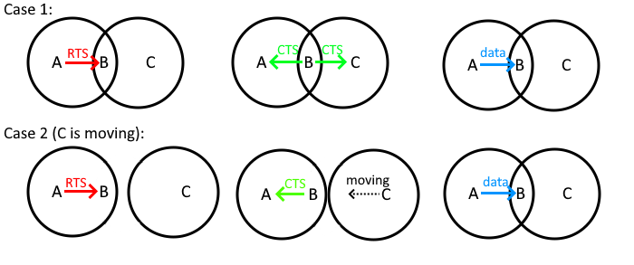

  <h1>Flashcards</h1>

## Chapter 1 - Wireless Communication

**Question**: How is the **wireless signal propagation** influenced? What are **channel fading models**? Provide some example.

<b>Answer: </b>

Wireless signals are less reliable than cabled ones, sincew ireless signals are never 100% guaranteed to be received.
When traveling through air, the wireless signal experiences propagation losses, due to the planet/atmosphere and physical phenomena. These losses influences the strength of the signal that, to
be received, needs to reach a given threshold.
To understand how wireless signals propagate, researches created 2 propagation models, based on Maxwell's laws:
- **Free-space loss**, according to which, the power of a wireless signal propagating in empty space decrease with its traveled distance (inverse of the square of the distance).
- **Plane earth loss**, according to which, due to Earth's curvature, the power of a wireless signal decreases when traveling along Earth's surface (inverse of the fourth power of the distance).

In real-world scenarios, the conditions are much more complex, and these are, in fact, just approximated models. In real world there are many phenomena that contribute to the
degradation of the wireless signal. The most important and common are:
- **shadowing**, is due to obstacles along signal path. Causes long-term/slow variation in signal strenght;
- **multipath fading**, is due to signal reaching the receiver through different paths. Causes rapid oscillations in signal strenght;
- **frequency selective fading**, is due to how different ranges in frequencies sprectrum react to noises and other effects. Causes frequency-dependent variations in signal strenght.

Also other phenomena, like rain, magnetic fields, irregular surfaces.

---

**Question**: How does **Ethernet** try to **avoid collision** on a shared communication medium?

<b>Answer: </b>

  
Ethernet is an optimistic approach, meaning that try to avoid collisions as bet as it can. There were old Ethernet competitors, such as token-passing ring, that instead avoided collisions by design, but they didn't have so much success as Ethernet.
Ethernet adopts the algorithm called CSMA/CD (which stands for Carrier Sensing Multiple Access with Collision Detection)
- **Carrier Sensing** (CS), means that the devices that participate in the communication, senses the medium (e.g. cable) to check if it's being used it's idle. If idle, the device trasmits immediately, otherwise it waits;
- **Multiple Access** (MA), means that the communication medium is shared between potentially multiple different devices, that could possibly want to use it at the same time;
- **Collision Detection** (CD). When a device transmits, it keeps listening to the medium and, in case it detects a collision, it immediately stops the trasmission and waits. To try again and retransmit, one must wait for a **random time interval**, choosen according to the **exponential backoff**: after each collision, the waiting time increases exponentially, preventing consecutive collision to happen.

---

**Question**: What is **CSMA/CD**? Can **CSMA/CD** work correctly over **wireless** medium? What are the **most common issues**?

<b>Answer: </b>

  
CSMA/CD is a collision detection algorithm used in Ethernet networks to manage access to a shared communication medium, typically a full-duplex cable in modern environments. It cannot work correctly in wireless communication, because the communication here is more like a probability: we're never 100% sure a message will be received or not, and there's no easy way to monitor a wireless signal.

Moreover, there are 2 most common issues

- Hidden node issue. It occurs when a node (A) starts transmitting to another one (B), and a third node (C) cannot detect the already ongoing transmission between the other two. Therefore, when it starts transmitting as well, it causes a collision;
- Exposed node issue. It occurs when a node (B) transmits to another node (A), and a third node (C) doesn't start transmitting to its peer (D) because it detects the already ongoin transmission between the other nodes, even tough it doesn't interefere with it.

---

**Question**: Does **MACA** solve hidden node and exposed node issues?

<b>Answer: </b>

  
- Hidden node issue: MACA can partially solve this issue, but there are still few cases when it may occurr. For example, C may not hear CTS because it was out of range, but it's moving towards B.
- Exposed node issue: is untouched.

However, MACA introduces also some overhead, and that's the reason why in modern implementations it's left optional.

---

**Question**: What is **GSM**? How is it **structured**? What are Home Location Register (**HLR**) and Visitor Location Register (**VLR**)?

<b>Answer: </b>

Global System for Mobile communications (GSM) is the most widely used standard for mobile phones globally, and serves as the foundations for 2G mobile networks, and its principles
are still used nowadays, in modern technologies. GSM has a hierarchical architecture that follows the locality principle.

A Mobile System (MS) is composed by:
- Terminal Equipment (TE), associated with SIM card, containing terminal/user specific data;
- Mobile Terminal (MT), that allows to communicate with the BSS;

A Base Station Subsystem (BSS) is composed by:
- Base Station Controller (BSC), that allocates radio channels and handles handovers. BSC manages many BTS;
- Base Transceiver Station (BTS), that handles connections with MS;

Mobile Switching Center (MSC) acts like a gateway to Public Switching Telephone Network (PSTN) and packet data networks (such as Internet).
MSC contains 2 registries:
- Home Location Register (HLR), is a centralized database that stores permanent information about subscribed mobile devices. When a user buys a subscription (via SIM card), all the subscription info gets registered in HLR;
- Visitor Location Register (VLR), is a temporary database that stores information about mobile devices that are currently within the MSC coverage area (under the BSSs it manages)

---

**Question**: How is the **handoff** handled in GSM (distinguish between same and different localities)? How is it **classified**? Is the MSC chain kept?

<b>Answer: TODO</b>

---

**Question**:

<b>Answer: TODO</b>

---

**Question**:

<b>Answer: TODO</b>

---

## Chapter 2 - Mobile Ad Hoc NETwork (MANET)

**Question**:

<b>Answer: </b>

---

**Question**:

<b>Answer: </b>

roba da chiedere al prof:
ho letto che le implementazioni moderne del WiFi utilizzano CSMA/CA, che praticamente integra MACA, ma in questo caso, viene comunque (solitamente) lasciato opzionale?

## Extra

Domande esami:

Chapter 1
- hidden node and exposed node issues
- MACA
- GSM: handoff handling
- GSM: handoff classification
- Bluetooth: main characteristics
- Bluetooth: differences between ACL and SCO? Is there retransmission in SCO? Why?
- ZigBee: topologies and roles?

CH1
- parlare di hidden/exposed node issues
- MACA caratteristiche 
- MACA risolve hidden/exposed node?
- Bluetooth: differenze SCO e ACL

Comunicazioni wireless
a. Si parli dei problemi dell’hidden node e exposed node

b. Maca per WiFi risolve questi problemi?
c. Caratteristiche del protocollo MACA
d. Per quanto tempo i nodi stanno in silenzio?
e. Il problema dell’exposed node è risolto da MACA?
f. Come può in nodo mobile interagire con questo protocollo?

Differenze tra SCO e ACL in bluetooth

GSM wireless communication
a. Come avviene la gestion dell’handoff in GSM?
b. Reattivo o proattivi?
c. Ci possono essere perdite di pacchetti?
d. Durante una chiamata lunga si crea una catena?

Wireless communication
a. GSM come viene gestito l’handoff nella stessa località?
b. Come viene gestito tra località diverse?
c. Viene mantenuta la catena di msc?
d. Può esservi la perdita di pacchetti nell’handoff?

Wireless communication bluetooth
a. Differenze tra SCO e ACL

Wireless communication
a. Zigbee quali sono le topologie?
b. Quali sono i ruoli?
